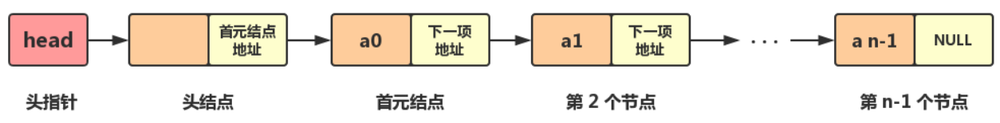

# 数据结构 (C++ 描述)

[TOC]

<br>

&emsp;

## 线性结构

### 线性表

- **定义：** 零个或多个数据元素的有限序列
  - 线性表的数据集合为 $\{a_1,a_2,\dots , a_n\}$，假设每个元素的类型均为 `DataType`。其中，除第一个元素 $a_1$ 外，每一个元素有且只有一个直接前驱元素，除了最后一个元素 $a_n$ 外，每一个元素有且只有一个直接后继元素。数据元素之间的关系是一对一的关系
  - 在较复杂的线性表中，一个数据元素可以由若干个数据项组成。在这种情况下，常把数据元素称为记录，含有大量记录的线性表又称为文件
- **线性结构：** 数据元素之间是一对一的关系
- **线性表：** 零个或多个数据元素的有限序列
- **区分数组容量与线性表的长度：**
  - 数组容量是指存放线性表的存储空间的长度，存储分配后这个值是不变的
  - 线性表的长度是线性表中数据元素的个数，随着线性表的插入与删除，这个值是在变换的
- **线性表的顺序存储：** 用一段连续的存储单元依次存储线性表的数据元素。（通常使用一维数组实现顺序存储结构）
- **线性表的链式存储：** 除了存储本身的信息之外，还需存储一个指示后继的信息
- **线性表基本操作主要有：**
  - `List MakeEmpty()`： 初始化一个空线性表 L
  - `ElementType FindKth(int K,List L)`：根据位序 K，返回相应元素
  - `int Find(ElementType X,List L)`：在线性表 L 中查找 X 的第一次出现位置
  - `void Insert(ElementType X,int i,List L)`：在位序 i 前插入一个新元素 X
  - `void Delete(int i,List L)`：删除指定位序 i 的元素
  - `int Length(List L)`：返回线性表 L 的长度 n

<br>

#### 顺序表

- **基本：**
  - **概念：** 用一组地址连续的存储单元依次存储线性表的数据元素，这种存储结构的线性表称为顺序表
  - **特点：** 逻辑上相邻的数据元素，物理次序也是相邻的
    - 只要确定好了存储线性表的起始位置，线性表中任一数据元素都可以随机存取，所以线性表的顺序存储结构是一种随机存取的储存结构
    - 因为高级语言中的数组类型也是有随机存取的特性，所以通常我们都使用数组来描述数据结构中的顺序储存结构，用**动态分配的一维数组表示线性表**
  - **复杂度：** 支持随机访问，为 $O(1)$。但在插入和删除时，要整体移动部分数组，最坏的情况为 $O(n)$
- **主要属性、方法：** 详见： [Vecotr.hpp](../../CPP/DataStruct/Vector.hpp)
  ```cpp {.line-numbers}
  template<class T>
  class Vector{
  private:
    T *arr;
    int curLength, curCapacity;
  public:
    Vecotr(int initLen = 0){
      curLength = curCapacity = initLen;
      arr = new T[curCapacity];
    }
  };
  ```
- **主要实现：**
  - 借助 `new T[]` 的动态数组，及 $2^n$ 大小的容量来存取数据
  - 如果不使用容量的话，每次增删数据都要进行重新**分配内存**(容量)这样耗时的操作。因此：
  - 当目前数组的长度未达到数组容量时，增加数据只要 `arr[len++] = value`、当目前的数组长度达到数组容量时，将重新分配容量，再增加数据
  - 重新分配容量要创建临时数组来存放当前的数据，再转移过去：
    ```cpp {.line-numbers}
    void reserve(int newCapacity) {
      if (newCapacity < curLength)
          return;
      T* temp = new T[newCapacity];
      for (int i = 0; i < curLength; ++i) {
        temp[i] = arr[i];
      }
      curCapacity = newCapacity;
      swap(arr, temp);
      delete[] temp;
    }
    ```
- **顺序表的优缺点：**
  - **优点：** 无须为表中元素之间的逻辑关系而增加额外的存储空间；可以快速的存取表中任一位置的元素
  - **缺点：** 插入和删除操作需要移动大量元素；当线性表长度较大时，难以确定存储空间的容量；造成存储空间的“碎片”

<br>

#### 链表

##### 单链表

- **定义：** 由一系列结点（链表中每一个元素称为结点）组成，每个结点包括两个部分：一个是存储数据元素的数据域，另一个是存储下一个结点地址的指针域
- **结构：**
  
  - **头指针：** 一个指向第一个节点地址的指针变量。头指针具有标识单链表的作用，所以经常用头指针代表单链表的名字
  - **头结点：** 在单链表的第一个结点之前附设一个结点，它没有直接前驱，称之为头结点。可不存信息，也可以作为监视哨，或用于存放线性表的长度等附加信息指针域中存放首元结点的地址
  - **首元结点：** 存储第一个元素的节点
- 其中，**头结点的作用：**
  - 链表如果为空的情况下，如果单链表没有头结点，那么头指针就会指向 `null`
  - 如果加上头结点，无论单链表是否为空，头指针都会指向头结点，这样使得空链表与非空链表处理一致，使首元结点前插入或删除元素的时候，与后面操作相同，不需要额外的判断分支
- **主要属性方法：** 详见： [List.hpp#List](../../CPP/DataStruct/List.hpp#L4)

  ```cpp {.line-numbers}
  template<class T> class List {
  private:
    struct Node {
      T data;
      Node* next;
      Node(const T value, Node* p) :
        data(value), next(p) {};
      Node(Node* p = nullptr) :
        next(p) {};
    };

    Node* head; // 头节点，链式地在 next 中存剩余的节点
    Node* tail; // 尾节点
    int curLength;

  public:
    List() {
      head = tail = new Node();
      curLength = 0;
    }
    ~List() {
      this->clear();
      delete head, tail;
    }
  };
  ```

- 在 **尾插元素** 上：尾节点的下一个节点指向 _新元素节点_，再把尾节点指向新元素节点
  ```cpp {.line-numbers}
  void push_back(const T value) {
    Node* p = new Node(value, nullptr);
    this->tail->next = p;
    this->tail = p;
    ++this->curLength;
  }
  ```
- 在增删节点之前，需要先找到 **指定下标的节点**：
  ```cpp {.line-numbers}
  Node* find(int index) const {
    if (index < 0 or index > curLength)
      throw outOfRange;
    int i = 0; Node* p = this->head;
    while (p and i++ < index)
      p = p->next; // 遍历寻找
    return p; // 返回的是该节点前一个到之后的所有节点
  }
  ```
- **在指定下标前插入：**
  ```cpp {.line-numbers}
  void insert(int index, const T value) {
    try {
      Node* p = this->find(index); // 先找到节点
      Node* newNode = new Node(value, p);
      // newNode 的首节点的 data 即 value，next 为 nullptr
      newNode->next = p->next; // 将新节点
      p->next = newNode;
      // 其实这里影响到了 head，等价于是
      // head 在节点 p 的 next 都指向了新节点
      ++this->curLength;
    } catch (const char* err) {
      std::cerr << err << '\n';
    }
  }
  ```
- **删除指定下标节点：**
  ```cpp {.line-numbers}
  void remove(int index) {
    try {
      Node* prev = this->find(index),
        * p = prev->next;
      // 目的是将目标节点的前一个节点的 next 指向下一个节点即可
      if (p == this->tail) {
        this->tail = prev;
        prev->next = nullptr;
        delete p;
      } else {
        prev->next = p->next;
        delete p;
      }
      --this->curLength;
    } catch (const char* err) {
      std::cerr << err << '\n';
    }
  }
  ```

<br>

##### 循环单链表

##### 双向链表

##### 循环双向链表

&emsp;&emsp;
<br>

## 树状结构

&emsp;&emsp;
<br>

## 图形结构

&emsp;&emsp;
<br>

## 集合结构

&emsp;&emsp;
<br>

## 参考

- 数据结构与算法分析 C++语言描述第四版 —— Mark Allen Weiss
- [知乎：C++ 单链表](https://zhuanlan.zhihu.com/p/84950700)
