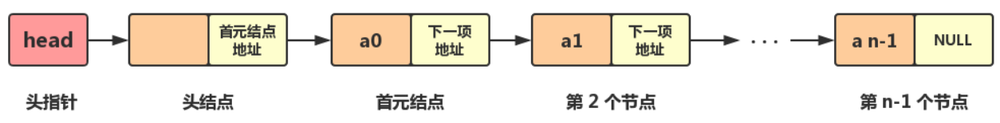

<br><p style="font-size: 32px; font-weight: bold;">目录</p>

- **参考：**
  - [知乎：C++ 单链表](https://zhuanlan.zhihu.com/p/84950700)

<!-- @import "[TOC]" {cmd="toc" depthFrom=2 depthTo=5 orderedList=false} -->

<!-- code_chunk_output -->

- [单链表](#单链表)
  - [定义](#定义)
- [循环单链表](#循环单链表)
- [双向链表](#双向链表)

<!-- /code_chunk_output -->

<br>

## 单链表

### 定义

由一系列结点（链表中每一个元素称为结点）组成，每个结点包括两个部分：一个是存储数据元素的数据域，另一个是存储下一个结点地址的指针域

**结构：**

<div align="center"><p></p><br></div>

- **头指针：** 一个指向第一个节点地址的指针变量，而不存数据。头指针具有标识单链表的作用，所以经常用头指针代表单链表的名字
- **头结点：** 在单链表的第一个结点之前附设一个结点，它没有直接前驱，称之为头结点。可不存信息，也可以作为监视哨，或用于存放线性表的长度等附加信息指针域中存放首元结点的地址
- **首元结点：** 存储第一个元素的节点
- 其中，**头结点的作用：**
  - 链表如果为空的情况下，如果单链表没有头结点，那么头指针就会指向 `null`
  - 如果加上头结点，无论单链表是否为空，头指针都会指向头结点，这样使得空链表与非空链表处理一致，使首元结点前插入或删除元素的时候，与后面操作相同，不需要额外的判断分支

**主要属性方法：** 详见： [List.hpp](https://github.com/Organic-Fish/FishCode/blob/master/CPP/DataStruct/List/List.hpp)

```cpp {.line-numbers}
template<class T> class List {
private:
  struct Node {
    T data;
    Node* next;
    Node(const T value, Node* p) :
      data(value), next(p) {};
    Node(Node* p = nullptr) :
      next(p) {};
  };

  Node* head; // 头节点，链式地在 next 中存剩余的节点
  Node* tail; // 尾节点
  int curLength;

public:
  List() {
    head = tail = new Node();
    curLength = 0;
  }
  ~List() {
    clear();
    delete head, tail;
  }
};
```

- 在 **尾插元素** 上：尾节点的下一个节点指向 _新元素节点_，再把尾节点指向新元素节点
  ```cpp {.line-numbers}
  void push_back(const T value) {
    Node* p = new Node(value, nullptr);
    tail->next = p;
    tail = p;
    ++curLength;
  }
  ```
- 在增删节点之前，需要先找到 **指定下标的节点**：

  ```cpp {.line-numbers}
  Node* find(int index) const {
    if (index < 0 or index > curLength)
      throw outOfRange;
    int i = 0; Node* p = head;
    while (p and i++ < index)
      p = p->next; // 遍历寻找
    return p; // 返回的是该节点前一个到之后的所有节点
  }
  ```

- **在指定下标前插入：**

  ```cpp {.line-numbers}
  void insert(int index, const T value) {
    try {
      Node* p = find(index); // 先找到节点
      Node* newNode = new Node(value, p);
      // newNode 的首节点的 data 即 value，next 为 nullptr
      newNode->next = p->next; // 将新节点
      p->next = newNode;
      // 其实这里影响到了 head，等价于是
      // head 在节点 p 的 next 都指向了新节点
      ++curLength;
    } catch (const char* err) {
      std::cerr << err << '\n';
    }
  }
  ```

  > 噢所谓的 “链表能快速地增删元素，但在指定位置时却要遍历” 的矛盾，是在于
  >
  > - 因为 **查找链表只需要读，数组移动元素除了读还需要写**。而对于很多介质来说，读比写快。甚至可能相差一个数量级。只是在远古时期的时候，写数据是一个开销很大的操作
  > - 以及在实际的应用中，更多的需求是 **删除|增加 某个节点 p**，而不是 _在指定下标删除增加_，而链表是记录了节点的数据了，只要删除增加那个 **数据** 所在的节点就行
  > - Ref: [知乎：链表和数组的插入删除时间复杂度都是 $O(n)$，为什么教材网络上说链表效率高？](https://www.zhihu.com/question/51545092)

- **删除指定下标节点：**
  ```cpp {.line-numbers}
  void remove(int index) {
    try {
      Node* prev = find(index),
        * p = prev->next;
      // 目的是将目标节点的前一个节点的 next 指向下一个节点即可
      if (p == tail) {
        tail = prev;
        prev->next = nullptr;
        delete p;
      } else {
        prev->next = p->next;
        delete p;
      }
      --curLength;
    } catch (const char* err) {
      std::cerr << err << '\n';
    }
  }
  ```

<br>

## 循环单链表

<br>

## 双向链表
