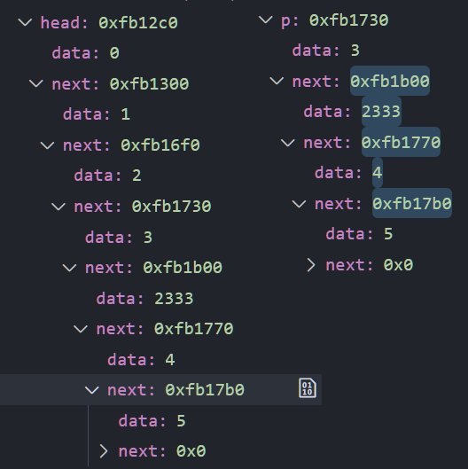

<br><p style="font-size: 32px; font-weight: bold;">目录</p>

- **参考：**
  - [知乎：C++ 单链表](https://zhuanlan.zhihu.com/p/84950700)

<!-- @import "[TOC]" {cmd="toc" depthFrom=2 depthTo=5 orderedList=false} -->

<!-- code_chunk_output -->

- [单链表](#单链表)
  - [定义](#定义)
- [循环单链表](#循环单链表)
- [双向链表](#双向链表)

<!-- /code_chunk_output -->

<br>

## 单链表

### 定义

<div class="art">

由一系列结点（链表中每一个元素称为结点）组成，每个结点包括两个部分：一个是存储数据元素的数据域，另一个是存储下一个结点地址的指针域

用数组存数据的特点就是数据的内存地址是连续的，就像是有序地排队；而链表的特点就在于数据的地址不一定是连续的，就好像是在医院等候一样，每个人只要记住自己下一个人是谁就好，只要那个人被叫到了那下一个就到自己了，而至于位置坐在哪里就不作要求了

这样的话，在数组的中间插入元素就得让后面的挪出位置给它，而链表只需要让后一个人重新记一下下个人的位置就好

</div>

<div class="h5">结构：</div>
<div align="center"><p></p><br></div>

- **头指针：** 一个指向第一个节点地址的指针变量，而不存数据。头指针具有标识单链表的作用，所以经常用头指针代表单链表的名字
- **头结点：** 在单链表的第一个结点之前附设一个结点，它没有直接前驱，称之为头结点。可不存信息，也可以作为监视哨，或用于存放线性表的长度等附加信息指针域中存放首元结点的地址
- **首元结点：** 存储第一个元素的节点
- 其中，**头结点的作用：**
  - 链表如果为空的情况下，如果单链表没有头结点，那么头指针就会指向 `null`
  - 如果加上头结点，无论单链表是否为空，头指针都会指向头结点，这样使得空链表与非空链表处理一致，使首元结点前插入或删除元素的时候，与后面操作相同，不需要额外的判断分支

<div class="h5">主要属性方法：</div>

> 详见： [List.hpp](https://github.com/Organic-Fish/FishCode/blob/master/CPP/DataStruct/List/List.hpp)

<div align="center"><p>现假设单链表 s 中的数据为 {1, 2, 3, 4, 5};</p></div><br>

**链表中的数据表示**

```cpp {.line-numbers}
template<class T> class List {
private:
  struct Node {
    T data;
    Node *next;

    Node(const T &value, Node *p) :
      data{value}, next{p} {};
    Node(Node* p = nullptr) :
      data{T()} next{p} {};
  };

  Node *head; // 头节点，链式地在 next 中存剩余的节点
  Node *tail; // 尾节点
  int curLength;
};
```

**单链表的构造与析构**。创建一个带头结点的空链表，析构时还要逐层释放空间

```cpp {.line-numbers}
public:
  List() {
    head = tail = new Node();
    curLength = 0;
  }
  ~List() {
    clear();
    delete head, tail;
  }
```

**清空单链表**。就是要从头结点开始逐层将后面的节点释放掉，但对于头结点 `next` 的指向又不想改变，那就得引入一个临时指针来释放

```cpp {.line-numbers}
void clear() {
  Node *p = head->next,
    *temp;
  while (p) {
    temp = p;
    p = p->next;
    delete temp;
  }
  head->next = nullptr;
  tail = head;
  curLength = 0;
}
```

**尾插元素：** 尾节点的下一个节点指向 _新元素节点_，再把尾节点指向新元素节点

```cpp {.line-numbers}
void push_back(const T &value) {
  Node *p = new Node(value);
  tail->next = p;
  tail = p;
  ++curLength;
}
```

**头插法：** 

```cpp {.line-numbers}
void push_front(const T &value) {
  // 新节点的下一个节点就一直指向首元节点
  Node *p = new Node(value, head->next);
  // 当链表为空的时候，尾指针就指向这个元素的节点
  if (!head->next) tail = p;
  // 再让数据节点当做首元结点
  head->next = p;
  ++curLength;
}
```

在增删节点之前，需要先找到 **指定下标的节点**：返回的是该节点的 **前一个节点** 到之后的所有节点

```cpp {.line-numbers}
Node* getNode(int index) const {
  if (index < 0 or index > curLength)
    throw outOfRange;
  int i = 0; Node* p = head;
  while (p and i++ < index)
    p = p->next; // 遍历寻找
  return p;
}
```

> s.getNode(3) 返回的是 data 为 3，next 指向 {4, 5} 的指针

**在指定下标前插入：**

```cpp {.line-numbers}
void insert(int index, const T &value) {
  // 先找到节点
  Node *p = getNode(index);
  // newNode 的首节点的 data 即 value，next 为 nullptr
  Node *newNode = new Node(value, p);
  newNode->next = p->next; // 将新节点
  // 其实这里影响到了 head，等价于是 head 在节点 p 的 next 都指向了新节点
  p->next = newNode;
  ++curLength;
}
```

<div align="center"><p>
  在 <code>getNode</code> 中，返回的p节点的 <b>首指针</b> 的地址与 head节点的第三个节点的地址相同，所以才做到了只是修改 p 但也影响到了 head
</p></div><br>

> 噢所谓的 “链表能快速地增删元素，但在指定位置时却要遍历” 的矛盾，是在于
>
> - 因为 **查找链表只需要读，数组移动元素除了读还需要写**。而对于很多介质来说，读比写快。甚至可能相差一个数量级。只是在远古时期的时候，写数据是一个开销很大的操作
> - 以及在实际的应用中，更多的需求是 **删除|增加 某个节点 p**，而不是 _在指定下标删除增加_，而链表是记录了节点的数据了，只要删除增加那个 **数据** 所在的节点就行
> - Ref: [知乎：链表和数组的插入删除时间复杂度都是 $O(n)$，为什么教材网络上说链表效率高？](https://www.zhihu.com/question/51545092)

<br>

**删除指定下标节点：**

```cpp {.line-numbers}
void remove(int index) {
  Node* prev = getNode(index);
  Node* p = prev->next;
  // 目的是将目标节点的前一个节点的 next 指向下一个节点即可
  if (p == tail) {
    tail = prev;
    prev->next = nullptr;
    delete p;
  } else {
    prev->next = p->next;
    delete p;
  }
  --curLength;
}
```

**反转链表：** 有点类似于先建一个链表的副本，再用头插法插到头结点中

```cpp {.line-numbers}
void inverse() {
  // p 作为是头结点的副本
  Node *p = head->next, *tmp;
  // 先清空链表的数据
  head->next = nullptr;
  if (p) tail = p;

  // 模拟头插法了
  while (p) {
    tmp = p->next;
    p->next = head->next;
    head->next = p;
    p = tmp;
  }
}
```

<br>

## 循环单链表

<br>

## 双向链表
