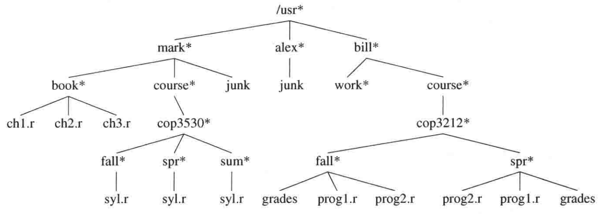
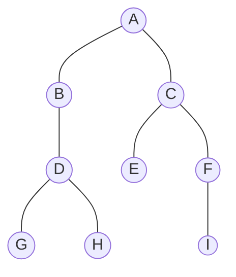

 
目录

<!-- @import "[TOC]" {cmd="toc" depthFrom=2 depthTo=5 orderedList=false} -->

<!-- code_chunk_output -->

- [概述](#概述)
  - [概念及术语](#概念及术语)
- [二叉树](#二叉树)
  - [分类](#分类)

<!-- /code_chunk_output -->

 

## 概述

线性表，栈，队列，串，等等，都是一对一的**线性结构**，而 “树” 则是一种典型的非线性结构。非线性结构的特点就是，任意一个结点的直接前驱，如果存在，则一定是唯一的；直接后继如果存在，则可以有多个，也可以理解为一对多的关系

树这种数据结构有很多的应用：如操作系统的文件管理的结构就是一个树状的，从根目录(磁盘)开始一直套娃下去打开文件夹直至没有文件夹或找到目标文件(夹)、又如 `Json`、`yaml`这类的数据存储类型都可以看做是树

  Unix 的文件层次树

 

正如 **打开文件夹找文件** 的过程而言，对树的遍历就是一个 **递归** 的过程（指只是点开下一个文件夹或返回键的情况下，毕竟在 GUI 下还可以直接点面包屑的节点跳转到先前节点），而内部对数据的存储的结构也是 **不连续的连式存储**

在之前的线性结构的表中，要么插入时要 $O(n)$，要么访问时也要 $O(n)$，而 **二叉查找树** 的大部分操作只要 $O(\log{n})$。C++ STL 中的 `std::map` 和 `std::set` 正是用 **红黑树** 来构造的

### 概念及术语

**先在这里种一棵二叉树：**

在这棵树中：

- **结点：** 包含数据项以及指向其他结点的分支，例如上图中圆 A 中，既包含数据项 A 又指向 B 和 C 两个分支
  - 特别的，因为 A 没有前驱，且有且只有一个，所以称其为**根结点(root)**
- **子树：** 由根结点以及根结点的所有后代导出的子图称为树的子树
- **结点的度：** 结点拥有子树的数目，简单的就是直接看有多少个分支，例如上图 A 的度为 2，B 的度为 1
- **叶结点：** 也叫作终端结点，即没有后继的结点，例如 E F G H I
- **分支结点：** 也叫作非终端结点，除叶结点之外的都可以这么叫
- **孩子结点：** 也叫作儿子结点，即一个结点的直接后继结点，例如 B 和 C 都是 A 的孩子结点
- **双亲结点：** 也叫作父结点，一个结点的直接前驱，例如 A 是 B 和 C 的双亲结点
- **兄弟结点：** 同一双亲的孩子结点互称为兄弟结点 例如 B 和 C 互为兄弟
- **堂兄弟：** 双亲互为兄弟结点的结点，例如 D 和 E 互为堂兄弟
- **祖先结点：** 从根结点到达一个结点的路径上的所有结点，A B D 结点均为 H 结点的祖先结点
- **子孙结点：** 以某个结点为根的子树中的任意一个结点都称为该结点的子孙结点，例如 C 的子孙结点有 E F I
- **结点的层次：** 设根结点层次为 1，其余结点为其双亲结点层次加 1，例如，A 层次为 1，B C 层次为 2
- **树的高度：** 也叫作树的**深度(deep)**，即树中结点的最大层次。这棵树就为 4
- **有序/无序树：** 树中结点子树是否从左到右为有

 

## 二叉树

二叉树（**Binary tree**）是每个结点**最多只有两个分支**（即不存在分支度大于 2 的结点）的树结构。通常分支被称作“左子树”或“右子树”。二叉树的分支具有左右次序，不能随意颠倒

### 分类

 
