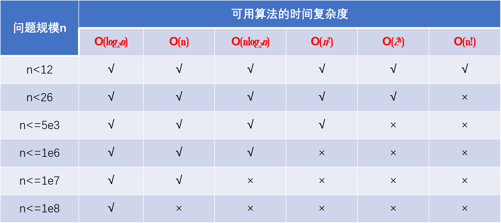
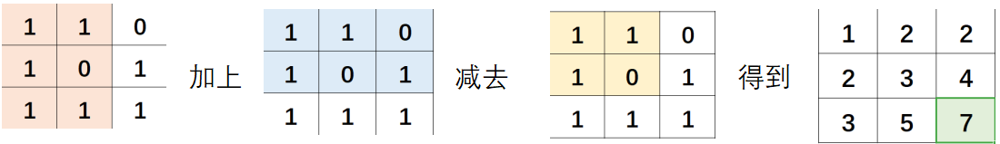

# 算 法 (C++ 描述)

- [C++ 小语法](../Cpp.md)
- **数据结构**
  - [STL](STL.md)
  - [手写实现](DataStruct.md)
  - [树、图](Tree_Graph.md)
- [排序算法](Sort.md)
- [动态规划 DP](DP.md)
- [搜索](Search.md)
- [字符串](String.md)
- [数学](Math.md)
- [喵啊的一些解法](miao.md)

[TOC]

## 小算法

### ACM

- **快读快写：**
  ```cpp {.line-numbers}
  ll read() {
    ll x = 0, f = 1; char c;
    while ((c = getchar()) and !isdigit(c))
        if (c == '-') f = -1;
    while (isdigit(c))
        x = x * 10 + c - '0', c = getchar();
    return  x * f;
  }
  void write(ll n) {
    if (n < 0) putchar('-'), n = -n;
    if (n > 9) write(n / 10);
    putchar(n % 10 + '0');
  }
  ```
- **头模板：**
  ```cpp {.line-numbers}
  #include <bits/stdc++.h>
  #define QAQ std
  #define endl "\n"
  #define ll long long
  #define PII pair<int, int>
  #define all(s) s.begin(), s.end()
  #define ios ios::sync_with_stdio(false), cin.tie(0), cout.tie(0)
  using namespace QAQ;
  ```

### 复杂度

**复杂度限制：**

- 在函数(非递归)中，一维数组大小不超过 1e5.
- 在全局变量中，一维数组大小不超过 1e8，二维数组大小不超过 1e4
- 对于 1s 的时间限制，需要保证程序的所有语句的总执行次数不超过 1e8.
  

一般 ACM 或者笔试题的时间限制是 1 秒或 2 秒。在这种情况下，C++代码中的操作次数控制在 $10^7∼10^8$ 为最佳。

下面给出在不同数据范围下，代码的时间复杂度和算法该如何选择：

- $n \le 30$： 指数级别， dfs+剪枝，状态压缩 dp
- $n \le 100  \to  O(n^3)$：floyd，dp，高斯消元
- $n \le 1000  \to  O(n^2), O(n^2\log_2n)$ ，dp，二分，朴素版 Dijkstra、朴素版 Prim、Bellman-Ford
- $n \le 10^4  \to  O(n \times \sqrt n)$：块状链表、分块、莫队
- $n \le 10^5  \to  O(n\log_2n)$： 各种 `sort`，线段树、树状数组、`set/map`、`heap`、拓扑排序、`dijkstra+heap`、`prim+heap`、`Kruskal`、`spfa`、求凸包、求半平面交、二分、`CDQ` 分治、整体二分、后缀数组、树链剖分、动态树
- $n \le 10^6  \to  O(n)$： 以及常数较小的 $O(n\log_2n)$ 算法 $\to$ 单调队列、 `hash`、双指针扫描、并查集，`kmp`、AC 自动机，常数比较小的 $O(n\log_2n)$ 的做法：sort、树状数组、heap、dijkstra、spfa
- $n \le 10^7  \to  O(n)$：双指针扫描、kmp、AC 自动机、线性筛素数
- $n \le 10^9  \to  O(\sqrt n)$：判断质数
- $n \le 10^{18}  \to  O(\log_2n)$：最大公约数，快速幂，数位 DP
- $n \le 10^{1000}  \to  O((\log_2n)^2)$：高精度加减乘除
- $n \le 10^{100000}  \to  O(\log_2k \times \log_2(\log_2k)$：k 表示位数，高精度加减、FFT/NTT

<br>
&emsp;

### 前缀和 / 区间和

- 一维：
  ```cpp {.line-numbers}
  for (i = 1; i <= n; i++){
          cin >> a[i];
          sum[i] = sum[i - 1] + a[i];
      }
  ```
- 差分：如给数组 `[l, r]` 之间加上 c

  ```cpp {.line-numbers}
  int n, m;
  scanf("%d%d", &n, &m);
  for (int i = 1; i <= n; i++)
  {
      scanf("%d", &a[i]);
      b[i] = a[i] - a[i - 1]; //构建差分数组
  }
  int l, r, c;
  while (m--)
  {
      scanf("%d%d%d", &l, &r, &c);
      b[l] += c, b[r + 1] -= c;
  }
  for (int i = 1; i <= n; i++)
  {
      b[i] += b[i - 1]; //求前缀和运算
      printf("%d ", b[i]);
  }
  ```

- 二维：

  - 求表
    

    ```cpp {.line-numbers}
    for (i = 1; i <= n; i++)  //打表
            for (j = 1; j <= m; j++) {
                cin >> mpa[i][j];
                sum[i][j] = mpa[i][j] + sum[i - 1][j] + sum[i][j - 1] - sum[i - 1][j - 1];
            }
    ```

  - 还原：
    

    ```cpp {.line-numbers}
    cin >> x1 >> y1 >> x2 >> y2;   //求表
    cout << sum[x2][y2] - sum[x1 - 1][y2] - sum[x2][y1 - 1] + sum[x1 - 1][y1 - 1];
    ```
