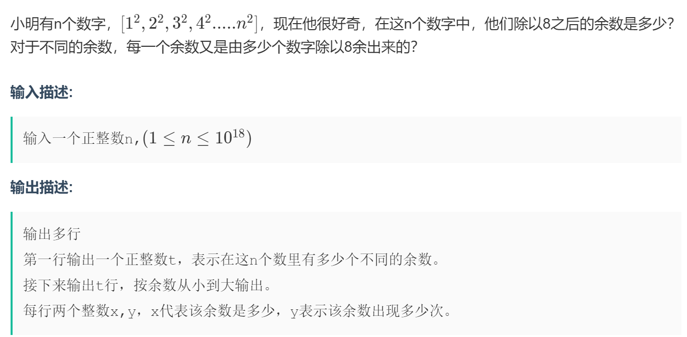
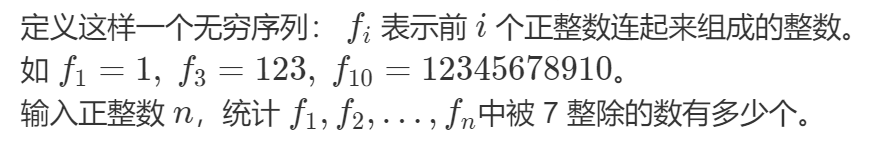
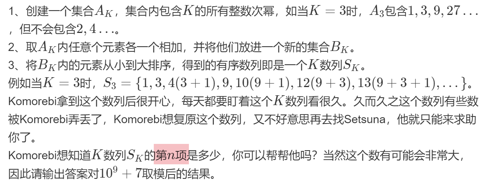

<br><p style="font-size: 32px; font-weight: bold;">目录</p>

<!-- @import "[TOC]" {cmd="toc" depthFrom=2 depthTo=5 orderedList=false} -->

<!-- code_chunk_output -->

- [周期循环](#周期循环)
- [拼接数字取模](#拼接数字取模)
- [幂运算 快速幂思想](#幂运算-快速幂思想)

<!-- /code_chunk_output -->

<br>

## 周期循环

- **[题目链接](https://ac.nowcoder.com/acm/contest/22672/B)**
- 
  <br>

- **AC 码**

  ```cpp {.line-numbers}
  #include <bits/stdc++.h>
  using namespace std;
  typedef long long ll;

  int main()
  {
      ll n, quan, yu;
      ll a[5] = {0};   //实际上余数就只有0 1 4 三种情况
      ll num[5] = {-1, 1, 4, 1, 0};  //余数的周期是4 ： 1 4 1 0

      cin >> n;
      quan = n / 4, yu = n % 4;
      a[0] = quan, a[1] = quan * 2, a[4] = quan;

      for (ll i = 1; i <= yu; i++) //周期之外
          a[num[i]]++;

      ll hv = (a[0] != 0) + (a[1] != 0) + (a[4] != 0);
      cout << hv << "\n";

      for (ll i = 0; i <= 4; i++)
          if (a[i] != 0)
              cout << i << " " << a[i] << "\n";
  }
  ```

<br>

## 拼接数字取模

- **[题目链接](https://ac.nowcoder.com/acm/contest/23846/D)**
- 
  <br>

- **AC 码**
  ```cpp {.line-numbers}
  int n, t;
  signed main()
  {
      for (cin >> t; t--;)
      {
          cin >> n;
          int x = 0, ans = 0;
          for (int i = 1; i <= n; i++)
          {
              x = stoi(to_string(x) + to_string(i)) % 7;
              ans += !x;
          }
          cout << ans << endl;
      }
  }
  ```

<br>

## 幂运算 快速幂思想

- **[题目链接](https://ac.nowcoder.com/acm/contest/30532/D)**
- 
  <br>

- **题解**

  &emsp;&emsp;观察到，将序列 $B$ 的 **下标 + 1** 以 **二进制** 列出后：
  | 0001 | 0010 | 0011 | 0100 | 0101 | 0110 | 0111 |
  | :--: | :--: | :--: | :--: | :--: | :--: | :--: |
  | 1 | 3 | 4 | 9 | 10 | 12 | 13 |

  3 的幂次数的下标为 `0001`， `0010`， `0100`， `1000`
  &emsp;&emsp;不难得出：类比二进制或快速幂的方法，将幂次数相加即为 **二进制数为 1 的幂数相加**

  - **快速幂:**
    | 8 | 4 | 2 | 1 |
    | :-: | :-: | :-: | :-: |
  - **幂次和：**
    | $\k^3$ | $k^2$ | $k^1$ | $k^0$|
    | :-----: | :-----: | :-----: | :-----: |

  &emsp;&emsp;例如：当 $n = 5, k = 3$ 时， $n$ 的 **二进制** 为 $0101$ ，即为 $3^2 + 3^0 = 10$

<br>

- **AC 码**

  ```cpp {.line-numbers}
  const int mod = 1e9 + 7;
  int main()
  {
      ll n, k, ans = 0, t = 1;
      cin >> n >> k;
      while (n)
      {
          if (n & 1)  (ans += t) %= mod;
          (t *= k) %= mod, n >>= 1;
      }
      cout << ans;
  }
  ```
