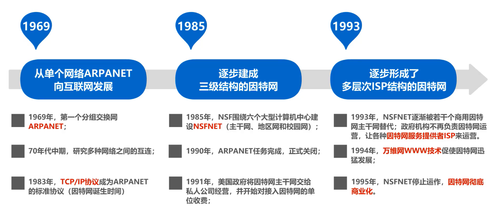

# {{ $frontmatter.title }}

目录

<!-- @import "[TOC]" {cmd="toc" depthFrom=1 depthTo=6 orderedList=false} -->

<!-- code_chunk_output -->

- 
  - [因特网概述](#因特网概述)
    - [网络、互联网和因特网](#网络-互联网和因特网)
    - [因特网发展的三个阶段](#因特网发展的三个阶段)
    - [因特网服务提供者 ISP](#因特网服务提供者-isp)
    - [因特网的组成](#因特网的组成)
    - [端系统之间的通信](#端系统之间的通信)
      - [客户-服务器方式](#客户-服务器方式)
      - [对等连接方式](#对等连接方式)
  - [网络的三种交换方式](#网络的三种交换方式)
    - [电路交换（Circuit Switching）](#电路交换circuit-switching)

<!-- /code_chunk_output -->

 
&emsp;

## 因特网概述

多个 **主机** 或 **端系统** 通过 **链路系统** 和 **分组交换机** 连接到一起。

- 链路系统主要是由不同类型的 **物理媒介** 组成，如网线、光纤、电缆等，链接的速度（**传输速率**）由 **bit/s** 或 **bps** 度量。它们将数据分组（packet）传输
- 交换机主要是 **路由器（router）** 和 **链路层交换机**。前者位于网络的核心中，后者常用于接入网中。交换机类似于是网络的分叉口，决定着数据要去的 **路径（path 或 route）**
- 端系统通过 **因特网服务提供商（ISP）** 接入到因特网
- 这些端系统、交换机和其他的因特网部件都要遵循一系列的 **协议**，这些协议控制着因特网中信息的接受和发送。其中以 **TCP（传输控制协议）** 和 **IP（网际协议）** 为重要

### 网络、互联网和因特网

**网络：** 网络（Network）由若干 **结点（Node）** 和连接这些结点的 **链路（Link）** 组成。

**互连网：** 多个网络通过路由器互连起来，这样就构成了一个覆盖范围更大的网络，即互连网。因此，互联网又称为“网络的网络（Network of Networks）”。

**因特网：** 因特网（Internet）是世界上最大的互连网络（用户数以亿计，互连的网络数以百万计）。

> **internet 与 Internet 的区别**
>
> - **internet(互连网)** 是一个通用名词，它泛指 **多个计算机网络互连而成的网络** 。在这些网络之间的通信协议可以是任意的
> - **Internet（因特网）则是一个专用名词** ，它 **特指采用 TCP/IP 协议族作为通信** 的规则当前全球最大的、开放的、由众多网络互连而成的特定计算机网络，其前身是美国的 ARPANET

> 任意把几个计算机网络互连起来（不管采用什么协议），并能够相互通信，这样构成的是一个互连网(internet) ，而不是因特网(Internet)

### 因特网发展的三个阶段

&emsp;&emsp;

 

  互联网的发展

### 因特网服务提供者 ISP

互联网服务供应商 (Internet Service Provider) ，又称因特网服务提供者、互联网服务提供商、**网络服务供应商**，即指提供互联网访问服务的公司。通常大型的电信公司都会兼任互联网服务供应商，一些 ISP 则独立于电信公司之外

中国的三大 ISP：

 

  三大 IPS

ISP 可以从因特网管理机构申请到成块的 IP 地址，同时拥有通信线路以及路由器等联网设备。任何机构和个人只需缴纳费用，就可从 ISP 的得到所需要的 IP 地址。

因为因特网上的主机都必须有 IP 地址才能进行通信，这样就可以通过该 ISP 接入到因特网

 

  基于 ISP 的三层结构的因特网

一旦某个用户能够接入到因特网，那么他也可以成为一个 ISP，所需要做的就是购买一些如调制解调器或路由器这样的设备，让其他用户可以和他相连。

### 因特网的组成

- **边缘部分**   &emsp;&emsp; 由所有连接在因特网上的 **主机** 组成（台式电脑，大型服务器，笔记本电脑，平板，智能手机等）。这部分是 **用户直接使用** 的，用来进行 **通信** （传送数据、音频或视频）和 **资源共享**
- **核心部分**   &emsp;&emsp; 由 **大量网络** 和连接这些网络的**路由器**组成。这部分是 **为边缘部分提供服务** 的（提供连通性和交换）。

**其中：**

- **路由器** 是一种专用计算机，但我们不称它为主机。路由器是实现分组交换的关键构建，其任务是转发收到的分组，这是网络核心最重要的部分。
- 处在互联网边缘的部分就是连接在互联网上的所有的主机。这些主机又称为 **端系统 (end system)**。

### 端系统之间的通信

**含义：** `主机 A 和主机 B 进行通信` 实际上是指：“运行在主机 A 上的某个程序和运行在主机 B 上的另一个程序进行通信”。即 **主机 A 的某个进程和主机 B 上的另一个进程进行通信** 。简称为 **计算机之间通信**

#### 客户-服务器方式

客户服务器方式（`Client`／`Server`方式）所描述的是进程之间服务和被服务的关系。客户和服务器都是指通信中所涉及的两个应用进程， **客户是服务的请求方，服务器是服务的提供方**

> 服务请求方和服务提供方都要使用网络核心部分所提供的服务

**客户软件的特点：** 被用户调用后运行，在打算通信时主动向远地服务器发起通信（请求服务），因此 **用户程序必须知道服务器程序的地址**

**服务器软件的特点：** 是一种专门用来提供某种服务的程序，可同时处理多个远地或本地客户的请求。 系统启动后即自动调用并**一直不断地运行着**，被动地等待并接受来自各地的客户的通信请求，因此服务器程序不需要知道客户程序的地址。

**注意：** 客户与服务器的通信关系建立后，通信可以是双向的，客户和服务器都可以发送和接收数据

在 C/S 模式中，数据的分发采用专门的服务器，多个客户端都从此服务器获取数据。

**优点是：** 数据的一致性容易控制，系统也容易管理。

**缺点是：** 因为服务器的个数只有一个(即便有多个也非常有限)，系统容易出现单一失效点；单一服务器面对众多的客户端，由于 CPU 能力、内存大小、网络带宽的限制，可同时服务的客户端非常有限，可扩展性差。

#### 对等连接方式

**对等连接** (`peer-to-peer`，简写为 **P2P** ) 是指两个主机在通信时并不区分哪一个是服务请求方还是服务提供方。

只要两个主机都运行了对等连接软件 ( P2P 软件) ，它们就可以进行**平等的、对等连接通信**。双方都可以下载对方已经存储在硬盘中的共享文档。

在 P2P 网络中，每个节点 **既可以从其他节点得到服务，也可以向其他节点提供服务**。这样，庞大的终端资源被利用起来，一举解决了 C/S 模式中的两个弊端。

P2P 应用软件主要包括 **文件分发软件**、语音服务软件、流媒体软件。目前 P2P 应用种类多、形式多样，没有统一的网络协议标准，其体系结构和组织形式也在不断发展。

> 更多关于 P2P：[P2P 技术原理](http://www.360doc.com/content/14/0305/17/8285430_357987074.shtml)，或备份 [p2p.md](P2P_backup.md) &emsp; | &emsp; [P2P 通信原理及其实现](https://evilpan.com/2015/10/31/p2p-over-middle-box/)

 
&emsp;

## 网络的三种交换方式

网络核心部分是互联网中最复杂的部分，要向网络边缘中的大量主机提供连通性，使边缘部分中的任何一个主机都能够向其他主机通信（即传送或接收各种形式的数据）

在网络核心部分起特殊作用的是 **路由器(router)**。路由器是实现 **分组交换** (packet switching) 的关键构件，其任务是 **转发** 收到的分组，这是网络核心部分最重要的功能。

### 电路交换（Circuit Switching）
