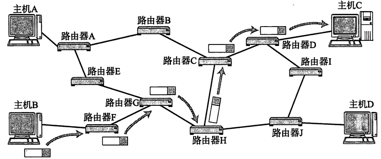

 
目录

<!-- @import "[TOC]" {cmd="toc" depthFrom=2 depthTo=5 orderedList=false} -->

<!-- code_chunk_output -->

- [概述](#概述)
- [IP 地址](#ip-地址)
  - [概述](#概述-1)
  - [IP 地址的分类](#ip-地址的分类)

<!-- /code_chunk_output -->

 

## 概述

IP 协议是整个 `TCP/IP 协议族` 的核心，也是构成互联网的基础，位于 TCP/IP 模型的网络层。用于屏蔽下层物理网络的差异，为上层提供统一的 IP 数据报

无连接的投递服务

发送端可于任何时候自由发送数据，而接收端永远不知道自己会在何时从哪里接收到数据。每个 IP 数据报独立处理和传输，一台主机发出的数据报序列，可能会走不同的路径， 甚至有可能其中的一部分数据报会在传输过程中丢失

不可靠的投递服务

IP 协议本身不保证 IP 数据报投递的结果。 在传输的过程中，IP 数据报可能会丢失、重复、延迟和乱序等， IP 协议不对内容作任何检测，也不将这些结果通知收发双方

IP 数据报的丢失，通过路由器发 **ICMP 报文** 告知； 必要时，由高层实体（如 TCP）负责差错恢复动作

尽力投递服务

每个数据链路上会规定一个最大传输单元 MTU，如果 IP 数据报的长度超过 MTU，那么网络层就会把这些报文分割成一个一个的小组（分组）进行传送，以适应具体的传输网络

 

## IP 地址

### 概述

IP 地址是 IP 协议中非常重要的内容，IP 数据报中含有 **收/发方的 IP 地址**

那就是给因特网上的**每台设备都规定了其全世界唯一的地址**，叫做 “IP 地址”。正是由于有了 IP 地址，才保证了用户在连网的计算机上操作时，能够高效而且方便地从千千万万台计算机中选出自己所需的对象来

IP 地址就好像**电话号码**（地址码）：有了某人的电话号码，你就能与他通话了。同样，有了某台主机的 IP 地址，你就能与这台主机通信了

  IP 的作用就是在复杂的网络环境中将数据包发送给指定的主机

 

按照 TCP/IP 协议规定，IP 地址用二进制来表示，每个 IP 地址长 32 比特，也就是 4 个字节（这里说的是 IPV4 地址长 **32 比特 / 4 字节**，而 IPV6 地址占 **128 比特 / 16 字节**）。那么，IPV4 地址的最大值就是 $2^{32} = 42,9496,7296$ ，也就是说：最多给大约 43 亿台接入互联网的设备配置其独一无二的 IPV4 地址，但在 2011 年 2 月 3 日，IPV4 就宣布耗尽了

一个采用二进制形式的 IP 地址是一串很长的数字，人们处理起来也太费劲了。为了方便人们的使用，IP 地址习惯性地被写成十进制的形式，使用 “.” 分开不同的字节。这种表示法叫做点分十进制表示法，这显然比一连串二进制地 1 和 0 容易记忆得多。举个例子：

  IP 地址的表示方式

 

### IP 地址的分类

