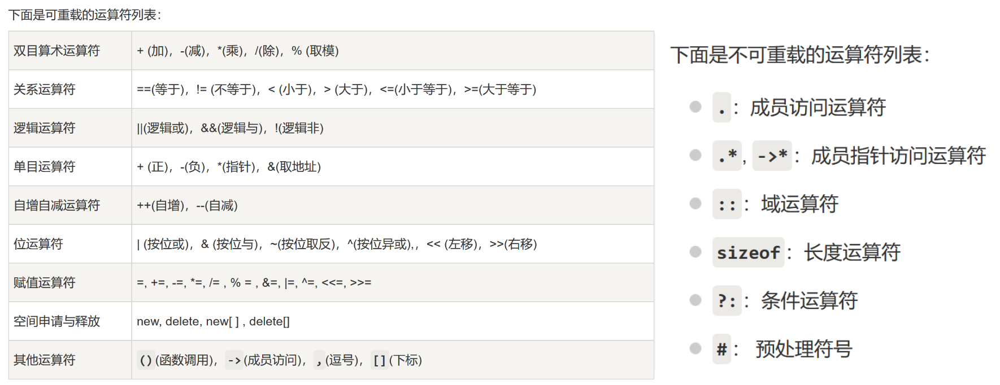
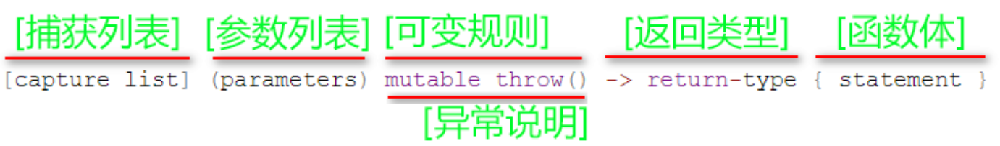
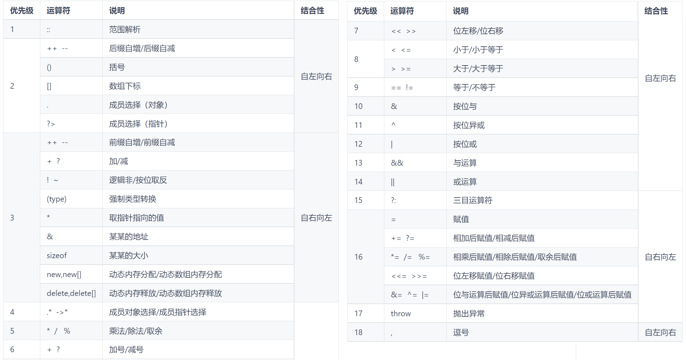

# {{ $frontmatter.title }}

<p style="font-size: 32px; font-weight: bold;">目录</p>

- **[算法 (C++ 描述)](Algorithm/README.md)**

<!-- @import "[TOC]" {cmd="toc" depthFrom=1 depthTo=6 orderedList=false} -->

<!-- code_chunk_output -->

- [](#)
  - [一些小语法](#一些小语法)
    - [命名规范](#命名规范)
    - [缓冲区](#缓冲区)
    - [stringstream](#stringstream)
    - [模板 template](#模板-template)
    - [Class 类](#class-类)
      - [定义类](#定义类)
      - [构造类](#构造类)
      - [继承](#继承)
      - [重载](#重载)
      - [explicit](#explicit)
    - [initializer_list &lt;T&gt; 列表初始化](#initializer_list-lttgt-列表初始化)
    - [Lambda 匿名函数](#lambda-匿名函数)
  - [C 語言中に](#c-語言中に)

<!-- /code_chunk_output -->

<br>
&emsp;

## 一些小语法

### 命名规范

**[编程语言中常用的变量命名缩写](https://blog.csdn.net/qq_37851620/article/details/94731227)**

### 缓冲区

**[C++ cin 详解及清空输入缓冲区](https://blog.csdn.net/selina8921/article/details/79067941)**

### stringstream

- **[C++ stringstream 介绍](https://www.cnblogs.com/wuchanming/p/3906176.html)**

- `getline` 与 `ss`
  ```cpp {.line-numbers}
  string s; int m; map<string, int> guo;
  getline(cin, s);
  stringstream ss;
  ss << s;
  while (ss >> s >> m)  guo[s] += m;
  ```
- `C++11` 前，没有 `to_string`：
  ```cpp {.line-numbers}
  string Itos(int x)  //int Stoi(string x)
  {
    string t; stringstream ss;  // stringstream ss; int t;
    ss << x, ss >> t, ss.clear();   //ss << x, ss >> t, ss.clear();
    return t;
  }
  ```

### 模板 template

- **[C++模板 template 用法总结](https://blog.csdn.net/qq_35637562/article/details/55194097)**

  ```cpp {.line-numbers}
  template <class T>  //单个类型
  T big(T x, T y){
    return x > y ? x : y;
  }
  template <class T1, class T2>  //不同类型
  inline const T2 Max(const T1 a, const T2 b){
    return a > b ? a : b;
  }
  ```

  ```cpp {.line-numbers}
  template <class out_type, class in_value>
  out_type transf(const in_value &t){
    stringstream stream; out_type result;
    stream << t, stream >> result, stream.sync();
    return result;
  }
  int main(){
    string s = "532";
    double t = transf<double>(s); // <>里的是要转换的类型名，()里的是被转换的变量名
  }
  ```

<br>

### Class 类

**Ref:**

- [简书\_继承方式](https://www.jianshu.com/p/1b661fbc8fb4)
- [拷贝构造函数\_知乎](https://zhuanlan.zhihu.com/p/157833251)

#### 定义类

- **访问权限：**

  - `public`：**任何地方** 都能访问
  - `private`：只能被 **类内访问**，被继承的子孙类都没法访问
  - `protected`：只能被 类内或被继承的子孙类 访问，构造的类不能访问。
    > 其实就是 不想放到 public 里但又想让子孙类访问，于是就有了 protected
  - `const` 限定：const 定义的类只能访问 类内的变量 _或_ 父类的非 private 的变量 _和_ 被 const 修饰的函数
  - `static` 静态：只能在静态的函数、变量、类之间访问，非静态定义的不能访问。使用不了 `this` 指针。
    - 且在非对象中调用对象内成员的 `::` 修饰符只能访问 静态成员
    - 而且使用前必须先初始化

- 与结构体类似，但是默认是以 `Private` 构造的。偏向 **数据结构** 的是结构体，偏向 **对象** 的是类

#### 构造类

- **构造函数：** 是指在定义类的时候就运行了。带参数时即给变量赋值。用法：
  ```cpp {.line-numbers}
  class mie {
  private:
      int aha;
  public:
      mie(int x) { aha = x; } //或
      mie(int x) : aha(x) {}
      void print() { cout << this->aha << endl; }
  };
  // 用法：
  mie m(12); m.print(); // 12
  ```
- **析构函数：** 是在删除对象时(或运行结束)时运行，有助于在跳出程序（比如关闭文件、释放内存等）前释放资源。
- **拷贝构造函数：** 即为在初定义时赋值。与定义后再赋值不同，那时需要 **重载** 等于号才能赋值。

  ```cpp {.line-numbers}
  class mie {
  public:
      int num;
      mie(int x) : num(x){};
      mie(const mie &m) { this->num = m.num; }
  };
  // 用：
  mie m(123);  mie mm = m;
  ```

- **友元：** 需要事先在类内定义，然后 加上 `friend` 就可以有权访问 **任何** 成员。且能防止什么都放到 `public` 里，还能节省开支。**但是：**
  1. 友元关系 **不能被继承**；
  2. 友元关系是 **单向的**，不具有交换性。即类 B 是类 A 的友元，则类 A 不一定是类 B 的友元，需要看类中是否有相应的声明；
  3. 友元关系 **不具有传递性**。即类 B 是类 A 的友元，类 C 是类 B 的友元，但类 C 不一定是类 A 的友元，需要看类中是否有相应的声明。
  4. 另外，使用一般不建议把整个类声明为友元类，而只将某些成员函数声明为友元函数，这样更安全些。

#### 继承

- **概念：** 在定义一个新的类 B 时，如果该类与某个已有的类 A 相似（指的是 B 拥有 A 的全部特点），那么就可以把 A 作为一个基类，而把 B 作为基类的一个派生类（也称子类）。
- **格式：**
  ```cpp {.line-numbers}
  class son : public | private | protected father {};
  ```
- **权限：** 继承方式 是用来指明父类成员在子类中的 **最高访问权限** 的
- 一个派生类继承了所有的基类方法，但下列情况除外：
  - 基类的构造函数、析构函数和拷贝构造函数
  - 基类的重载运算符
  - 基类的友元函数

#### 重载

- **重载运算符：**
  - 
- **一元运算符：** 如负号、自增自减
  ```cpp {.line-numbers}
  Stu operator++() { // 前缀自增：++mie;
      score++;
      return *this;
  }
  Stu operator++(int) // 后缀自增：mie++: 带参数且与被加数类型相等
  {
      ++*this;
      return *this;
  }
  ```
- **二元运算符：** 加减乘除膜
  - 对象之间相加：
    ```cpp {.line-numbers}
    Stu operator+(Stu &a) // c = b+a; --> c = this+a
    {
        a.score += this->score;
        return a;
    }
    ```
  - 对象与变量相加
    - 对象加变量
      ```cpp {.line-numbers}
      Stu operator+(int x)
      {
          Stu a;
          a.score = this->score + x;
          return a;
      }
      ```
    - 变量加对象，且要用 `friend`
      ```cpp {.line-numbers}
      friend Stu operator+(const int x, Stu &a)
      {
          a.score += x;
          return a;
      }
      ```
- **关系运算符重载：** 诸如大于号等比较符。用 bool 定义：
  ```cpp {.line-numbers}
  bool operator<(Stu &a)
  {
      return this->score < a.score;
  }
  ```
- **输入输出流重载：** 当然也适用于文件流
  ```cpp {.line-numbers}
  friend ostream &operator<<(ostream &out, const Stu &a)
  {
      out << "score: " << a.score << endl;
      return out;
  }
  friend istream &operator>>(istream &in, Stu &a)
  {
      in >> a.score;
      return in;
  }
  // to use:
  Stu mie;
  cin >> mie; cout << mie;
  ```

#### explicit

- 用于避免**不合预期**的构造方法。如：
  ```cpp {.line-numbers}
  class String {
  private:
    int len;
    char* str;
  public:
    String(int a): len{a} {};
    String(char* a)
      : len{strlen(a)}, str{a} {};
  };
  int main() {
    String a1(23); // 初始化长度
    String a2 = 23; // ？？
    String a3 = "233s"; // 初始化
  }
  ```
  原本只想让等号用于 _构造字符串_，但在这却可以直接 _初始化长度_，而且编译通过。所以在这种情况下就应该：
  ```cpp {.line-numbers}
  explicit String(int a): len{a} {};
  ```
  这样，当用等号赋值数字时编译便会报错

> **注：** `explicit` 关键字只需用于类内的**单参数构造函数**前面。由于无参数的构造函数和多参数的构造函数总是显示调用，这种情况在构造函数前加 `explicit` 无意义

<br>
&emsp;

### initializer_list &lt;T&gt; 列表初始化

- 列表初始化常见于，使用 `{}` 序列来初始化：
  ```cpp {.line-numbers}
  vector<int> arr1{1, 2, 3, 4},
              arr2 = {3, 4, 5, 6};
  ```
- **使用：**
  ```cpp {.line-numbers}
  template<class T>
  void print(initializer_list<T> l){
    const int len = l.size(); // 列表的长度
    // 头尾迭代器
    for (auto it = l.begin(); it != l.end(); ++it){
      cout << *it << " ";
    }
  }
  // to use:
  print({2, 3, 4});
  ```

<br>
&emsp;

### Lambda 匿名函数

- **定义：**

  - 
  - **捕获**
    - 当为默认的 `[]` 时，lambda 内是不能访问当前作用域中的变量的（除了全局）
    - 而 `[&]` 表示按引用访问，`[=]` 表示按值访问，多变量见用逗号分隔
  - **参数列表：** 可省略，带则和普通函数差不多
  - **可变的 `mutable`：** 默认下 lambda 是 const 的，加了这个就可以改变捕获到的值

- **原理：**
  ```cpp {.line-numbers}
  string s = "abandon";
  char c = 'a';
  cout << count_if(all(s), [c](char &a)
                { return a == c; });
  ```
  ↑ 就相当于定义了这么一个：
  ```cpp {.line-numbers}
  class Lambda
  {
  private:
      char c;
  public:
      Lambda(char cc) : c(cc) {}
      bool operator()(const char &a) const { return a == c; }
  };
  //
  count_if(all(s), Lambda(c));
  ```

<br>

> REF: [C ++ Lambda 表达式详解](https://blog.csdn.net/A1138474382/article/details/111149792)

<br><br>

## C 語言中に

<br>
&emsp;

- **数组长度：**
  ```cpp {.line-numbers}
  int len = sizeof(b)/sizeof(int);
  ```
- **`memset`：** 批量赋值只能是 `char` 用，`int` 只能给 -1 或 0， 而：
  ```cpp {.line-numbers}
  memset(a, 127, sizeof(a))   //赋值无穷大
  memset(a, 128, sizeof(a))   //赋值无穷小
  ```
- **`ctime`：**
  - 时间戳获取与转换
    ```cpp {.line-numbers}
    time_t t = time(0);
    // cin >> t; //当然，也能输入时间戳（秒）
    char tmp[32] = {}, form[] = "%Y-%m-%d %H:%M:%S";
    strftime(tmp, sizeof(tmp), form, localtime(&t));
    cout << tmp << endl;
    ```
  - 当前时间
    ```cpp {.line-numbers}
    time_t t = time(&t);
    string s = ctime(&t);
    cout << s << endl;
    ```
- **`cctype`：**
  ```cpp {.line-numbers}
  //只能用在单个字符
  isalnum(c) //-->是否为字母或者数字
  isalpha(c) //-->是否为字母
  isblank(c) //-->是否为空格或者 tab
  isdigit(c) //-->是否为数字
  ispunct(c) //-->是否为符号
  isupper(c) //-->是否为大写字母
  isspace(c) //-->是否为空格
  ```
- **`sprintf`：**
  ```cpp {.line-numbers}
  sprintf(ans, "%d+%d=%d", x, y, x + y);
  // →同时还把 + = 也存进去了
  ```
- **符号优先级：**
  
