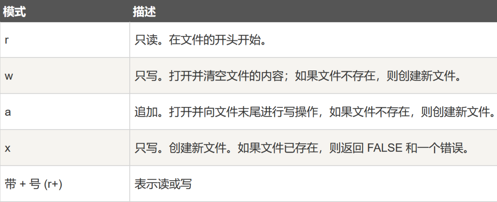

 

:::note
记得洗手）
:::

 

- [C++ 与 C 语言](Cpp.md)
- [C#](CSharp.md)
- [Java](Java/JavaSE.md)
- [Python](Python.md)
- [PHP](PHP.md)
- [MySQL](MySQL.md)
- [ $\LaTeX$ ](LaTeX.md)
- [Regex](Regex.md)

 

