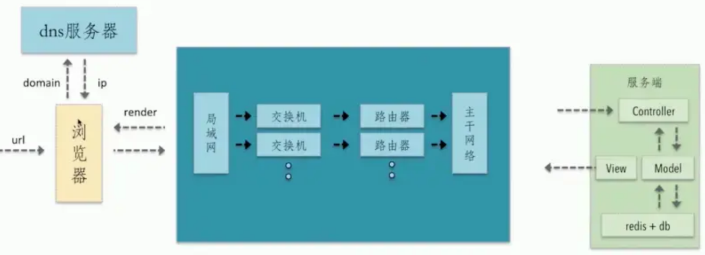

 #  HTTP | HTTPS 

- **外链：**
  - [HTTP1、2、3](https://juejin.cn/post/6995109407545622542)
  - [菜鸟 content-type](HTTPS://www.runoob.com/HTTP/HTTP-content-type.html)
  - [菜鸟 状态码](HTTPS://www.runoob.com/HTTP/HTTP-status-codes.html)
  - [阮一峰 cors](HTTPS://www.ruanyifeng.com/blog/2016/04/cors.html)

[TOC]

 

# HTTP 和 HTTPS

## 基本概念

- `HTTP`: 是一个**客户端**和**服务器端**请求和应答的**标准**（`TCP`），用于从 `WWW` 服务器传输超文本到本地浏览器的**超文本传输协议**
- `HTTPS`:是以安全为目标的 `HTTP` 通道，即 `HTTP` 下 加入 `SSL` 层进行**加密**。其作用是：建立一个信息安全通道，来确保数据的传输，确保网站的真实性

## 区别及优缺点

- `HTTP` 是超文本传输协议，信息是**明文传输**，`HTTPS` 协议要比 `HTTP` 协议安全。`HTTPS` 是具有安全性的 `ssl` 加密传输协议，可防止数据在传输过程中被窃取、改变，确保数据的完整性 (当然这种安全性并非绝对的)
- `HTTP` 协议的默认端口为 `80`，`HTTPS` 的默认端口为 `443`
- `HTTP` 的连接很简单，是无状态的。`HTTPS` 握手阶段比较费时，会使页面加载时间延长 `50%`，增加 `10%`~`20%`的耗电
- `HTTPS` 缓存不如 `HTTP` 高效，会增加数据开销
- `Https` 协议需要 `ca` 证书，费用较高，功能越强大的证书费用越高
- `SSL` 证书需要绑定 `IP`，不能再同一个 `IP` 上绑定多个域名，`IPV4` 资源支持不了这种消耗

## HTTPS 协议的工作原理

客户端在使用 `HTTPS` 方式与 `Web` 服务器通信时有以下几个步骤：

- 客户端使用 `HTTPS url` 访问服务器，则要求 `web` 服务器建立 `ssl` 链接
- `web` 服务器接收到客户端的请求之后，会将网站的证书（证书中包含了公钥），传输给客户端
- 客户端和 `web` 服务器端开始协商 `SSL` 链接的安全等级，也就是加密等级
- 客户端浏览器通过双方协商一致的安全等级，建立会话密钥，然后通过网站的公钥来加密会话密钥，并传送给网站
- `web` 服务器通过自己的私钥解密出会话密钥
- `web` 服务器通过会话密钥加密与客户端之间的通信

&emsp;

 

# 请求报文

&emsp;
`HTTP` 报文的组成成分：

- **请求报文**：{ 请求行、请求头、空行、请求体 }
- **请求行**：{ http 方法、页面地址、http 协议、http 版本 }
- **响应报文**：{ 状态行、响应头、空行、响应体 }

## 请求方法

<table style="text-align:left;"><tbody><tr><th width="5%">序号</th><th width="10%">方法</th><th>描述</th></tr><tr><td>1</td><td>GET</td><td>请求指定的页面信息，并返回实体主体。</td></tr><tr><td>2</td><td>HEAD</td><td>类似于GET请求，只不过返回的响应中没有具体的内容，用于获取报头</td></tr><tr><td>3</td><td>POST</td><td>向指定资源提交数据进行处理请求（例如提交表单或者上传文件）。数据被包含在请求体中。POST请求可能会导致新的资源的建立和/或已有资源的修改。</td></tr><tr><td>4</td><td>PUT</td><td>从客户端向服务器传送的数据取代指定的文档的内容。</td></tr><tr><td>5</td><td>DELETE</td><td>请求服务器删除指定的页面。</td></tr><tr><td>6</td><td>CONNECT</td><td>HTTP/1.1协议中预留给能够将连接改为管道方式的代理服务器。</td></tr><tr><td>7</td><td>OPTIONS</td><td>允许客户端查看服务器的性能。</td></tr><tr><td>8</td><td>TRACE</td><td>回显服务器收到的请求，主要用于测试或诊断。</td></tr><tr><td>9</td><td>PATCH</td><td>是对PUT方法的补充，用来对已知资源进行局部更新。</td></tr></tbody></table>

 

**GET 与 POST 的区别**

- **1.浏览器回退表现不同**：GET 在浏览器回退时是无害的，而 POST 会再次提交请求
- **2.浏览器对请求地址的处理不同**：GET 请求地址会被浏览器主动缓存，而 POST 不会，除非手动设置
- **3.浏览器对响应的处理不同**：GET 请求参数会被完整的保留在浏览器历史记录里，而 POST 中的参数不会被保留
- **4.参数大小不同**：GET 请求在 URL 中传送的参数是有长度的限制，而 POST 没有限制
- **5.安全性不同**：GET 参数通过 URL 传递，不安全；POST 放在 `Request Body` 中，相对更安全。但因为 HTTP 传输的内容都是明文的，虽然在浏览器地址拦看不到 POST 提交的 body 数据，但是只要抓个包就都能看到了。所以，要避免传输过程中数据被窃取，就要使用 **HTTPS 协议**，这样所有 HTTP 的数据都会被加密传输。
- **6.针对数据操作的类型不同**：GET 对数据进行查询，POST 主要对数据进行增删改！简单说，GET 是只读，POST 是写。

 

## Request Header 请求头

这里设置的主要是一些信息，包含客户端，服务器

- `GET/`：请求行
- `Host`：请求的目标域名和端口，允许多个域名同处一个 IP 地址，即虚拟主机
- `User-Agent`：浏览器的具体类型，如：`User-Agent：Mozilla/5.0 (Windows NT 6.1; rv:17.0) Gecko/20100101 Firefox/17.0`
- `Accept`：客户端希望接受的数据类型，如：`Accept: text/html,application/xhtml+xml,application/xml;q=0.9;`
- `Accept-Charset`：浏览器采用的编码方式，如：`Accept-Charset: ISO-8859-1`
- `Accept-Encoding`：浏览器支持解码的数据压缩格式,如：`Accept-Encoding: gzip, deflate`
- `Accept-Language`：浏览器的语言环境,如：`Accept-Language zh-cn,zh;q=0.8,en-us;q=0.5,en;q=0.3`
- `Connection`：表示是否需要持久的 TCP 连接。`Keep-Alive` | `close`。`HTTP1.1` 默认是持久连接，它可以利用持久连接的优点，当页面包含多个元素时（例如图片），显著地减少下载所需要的时间
- `Content-Length`：表示请求消息正文的长度。对于 `POST` 请求来说是必须出现
- `Content-Type`：WEB 服务器告诉浏览器自己响应的对象的类型和字符集。例如：`Content-Type: text/html; charset='gb2312'`
- `Content-Encoding`：WEB 服务器表明自己使用了什么压缩方法来压缩响应中的对象。例如：`Content-Encoding：gzip`
- `Content-Language`：WEB 服务器告诉浏览器自己响应的对象的语言
- `Cookie`：浏览器每次都会将` cookie` 发送到服务器上，允许服务器在客户端存储少量数据
- `Referer`：包含一个 URL，用户从该 URL 代表的页面出发访问当前请求的页面。服务器能知道你是从哪个页面过来的。`Referer: HTTP://www.baidu.com/`

&emsp;

**`Content-Type` 的一些类型：**

- 常见的媒体格式类型如下：
  - `text/html`： HTML 格式
  - `text/plain`：纯文本格式
  - `text/xml`： XML 格式
  - `image/gif`：gif 图片格式
  - `image/jpeg`：jpg 图片格式
  - `image/png`：png 图片格式
- 以 `application` 开头的媒体格式类型：
  - `application/xhtml+xml`：XHTML 格式
  - `application/xml`： XML 数据格式
  - `application/atom+xml`：Atom XML 聚合格式
  - `application/json`： JSON 数据格式
  - `application/pdf`：pdf 格式
  - `application/msword`： Word 文档格式
  - `application/octet-stream`： 二进制流数据（如常见的文件下载）
  - `application/x-www-form-urlencoded`： `<form encType="">`中默认的 `encType`，form 表单数据被编码为 `key/value` 格式发送到服务器（表单默认的提交数据的格式）
- 另外一种常见的媒体格式是上传文件之时使用的：
  - `multipart/form-data `： 需要在表单中进行文件上传时，就需要使用该格式

## Request Body 请求体

这里是提交给服务器的数据

需要注意的是,如果是往服务器提交数据,需要在请求头中设置 `Content-Type:application/x-www-form-urlencoded`

&emsp;

 

# 响应报文

响应报文是服务器发回给客户端的。组成部分有**状态行**，**响应头**，**响应主体**

## 状态行

由协议版本号、状态码和状态信息构成。如：`HTTP/1.1 200 OK`

常见的状态码：

- 1XX：属于提示信息，是协议处理中的一种中间状态，实际用到的比较少。
  - `100 Continue`：一般在发送 post 请求时，已发送了 `HTTP header`：之后服务端将返回此信息，表示确认，之后发送具体参数信息
- 2XX：表示服务器成功处理了客户端的请求
  - `200 OK`：正常返回信息
  - `201 Created`：请求成功并且服务器创建了新的资源
  - `202 Accepted`：服务器已接受请求，但尚未处理
  - `204 No Content`：也是常见的成功状态码，与 200 OK 基本相同，但响应头没有 body 数据
  - `206 Partial Content`：是应用于 HTTP 分块下载或断点续传，表示响应返回的 body 数据并不是资源的全部，而是其中的一部分，也是服务器处理成功的状态
- 3XX：表示客户端请求的资源发生了变动，需要客户端用新的 URL 重新发送请求获取资源，也就是**重定向**
  - `301 Moved Permanently`：表示**永久重定向**，说明请求的资源已经不存在了，需改用新的 URL 再次访问。
  - `302 Found`：表示**临时重定向**，说明请求的资源还在，但暂时需要用另一个 URL 来访问。
    301 和 302 都会在响应头里使用字段` Location`，指明后续要跳转的 URL，浏览器会自动重定向新的 URL。
  - `304 Not Modified`：不具有跳转的含义，表示资源未修改，重定向已存在的缓冲文件，也称**缓存重定向**，也就是告诉客户端可以继续使用缓存资源，用于缓存控制。
- 4XX：表示 **客户端发送的报文有误**，服务器无法处理，也就是错误码的含义。
  - `400 Bad Request`：表示客户端请求的报文有错误，但只是个笼统的错误。
  - `401 Unauthorized`：请求**未授权**
  - `403 Forbidden`表示服务器禁止访问资源，并不是客户端的请求出错。
  - `404 Not Found`：表示请求的资源在服务器上不存在或未找到，所以无法提供给客户端。
- 5XX: 表示客户端请求报文正确，但是**服务器处理时内部发生了错误**，属于服务器端的错误码。
  - `500 Internal Server Error`：与 400 类型，是个笼统通用的错误码，服务器发生了什么错误，我们并不知道。
  - `501 Not Implemented`：表示客户端请求的功能还不支持，类似“即将开业，敬请期待”的意思。
  - `502 Bad Gateway`：通常是服务器作为网关或代理时返回的错误码，表示服务器自身工作正常，访问后端服务器发生了错误。
  - `503 Service Unavailable`：表示服务器当前很忙，暂时无法响应客户端，类似“网络服务正忙，请稍后重试”的意思。

 

## 响应头

- `Date`：服务端发送资源时的 **服务器时间**
- `Server`：服务器信息
- `Last-Modified`：服务器发来的当前资源最后一次修改的时间，下次请求时，如果服务器上当前资源的修改时间大于这个时间，就返回新的资源内容
- `ETag`：资源修改后生成的唯一标识，由服务器自动生成
- `Content-Length`：响应主体长度
- `Content-Type`：响应资源的类型

## 响应主体

即服务端返回给客户端的内容
&emsp;
 

# 从输入 URL 到页面加载的全过程

1. 首先在浏览器中输入 `URL`
2. **查找缓存**：浏览器先查看浏览器缓存-系统缓存-路由缓存中是否有该地址页面，如果有则显示页面内容。如果没有则进行下一步。
   - **浏览器缓存**：浏览器会记录 `DNS` 一段时间，因此，只是第一个地方解析 `DNS` 请求；
   - **操作系统缓存**：如果在浏览器缓存中不包含这个记录，则会使系统调用操作系统， 获取操作系统的记录(保存最近的 `DNS` 查询缓存)；
   - r：如果上述两个步骤均不能成功获取 `DNS` 记录，继续搜索路由器缓存；
   - `ISP` 缓存：若上述均失败，继续向 `ISP` 搜索。
3. **`DNS` 域名解析**：浏览器向 `DNS` 服务器发起请求，解析该 `URL` 中的域名对应的 `IP` 地址。`DNS` 服务器是基于 `UDP` 的，因此会用到 `UDP` 协议。
4. **建立 `TCP` 连接**：解析出 `IP` 地址后，根据 `IP` 地址和默认 `80` 端口，和服务器建立 `TCP` 连接
5. **发起 `HTTP` 请求**：浏览器发起读取文件的 `HTTP` 请求，，该请求报文作为 `TCP` 三次握手的第三次数据发送给服务器
6. **服务器响应请求并返回结果**：服务器对浏览器请求做出响应，并把对应的 `html` 文件发送给浏览器
7. **关闭 `TCP` 连接**：通过四次挥手释放 `TCP` 连接
8. **浏览器渲染**：客户端（浏览器）解析 `HTML` 内容并渲染出来，浏览器接收到数据包后的解析流程为：
   - **构建 `DOM` 树**：词法分析然后解析成 `DOM` 树（`dom tree`），是由 `dom` 元素及属性节点组成，树的根是 `document` 对象
   - **构建 `CSS` 规则树**：生成 `CSS` 规则树（`CSS Rule Tree`）
   - **构建 `render` 树**：`Web` 浏览器将 `DOM` 和 `CSSOM` 结合，并构建出渲染树（`render tree`）
   - **布局（`Layout`）**：计算出每个节点在屏幕中的位置
   - **绘制（`Painting`）**：即遍历 `render` 树，并使用 `UI` 后端层绘制每个节点。
9. **`JS` 引擎解析**过程：调用 `JS` 引擎执行 `JS` 代码（JS 的解释阶段，预处理阶段，执行阶段生成执行上下文，VO，作用域链、回收机制等等）
   - **创建 `window` 对象**：`window` 对象也叫全局执行环境，当页面产生时就被创建，所有的全局变量和函数都属于 `window` 的属性和方法，而 `DOM Tree` 也会映射在 `window` 的 `doucment` 对象上。当关闭网页或者关闭浏览器时，全局执行环境会被销毁。
   - **加载文件**：完成 `js` 引擎分析它的语法与词法是否合法，如果合法进入预编译
   - **预编译**：在预编译的过程中，浏览器会寻找全局变量声明，把它作为 `window` 的属性加入到 `window` 对象中，并给变量赋值为 `undefined`；
     &emsp; 寻找全局函数声明，把它作为 `window` 的方法加入到 `window` 对象中，并将函数体赋值给他（匿名函数是不参与预编译的，因为它是变量）
     &emsp; 而变量提升作为不合理的地方在 `ES6` 中已经解决了，函数提升还存在。
   - **解释执行**：执行到变量就赋值，如果变量没有被定义，也就没有被预编译直接赋值，在 `ES5` 非严格模式下这个变量会成为 `window` 的一个属性，也就是成为全局变量。
     &emsp; `string、int` 这样的值就是直接把值放在变量的存储空间里，`object` 对象就是把指针指向变量的存储空间。
     &emsp; 函数执行，就将函数的环境推入一个环境的栈中，执行完成后再弹出，控制权交还给之前的环境。**JS 作用域** 其实就是这样的执行流机制实现的。
