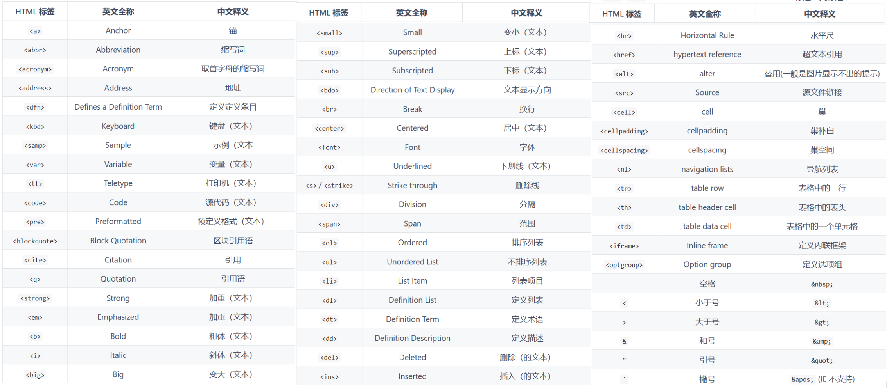
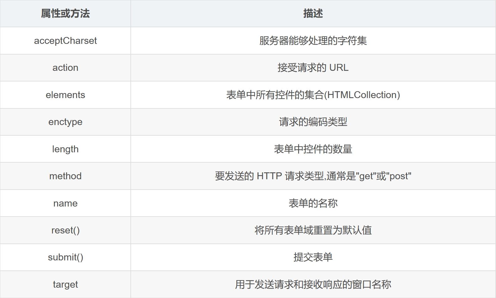
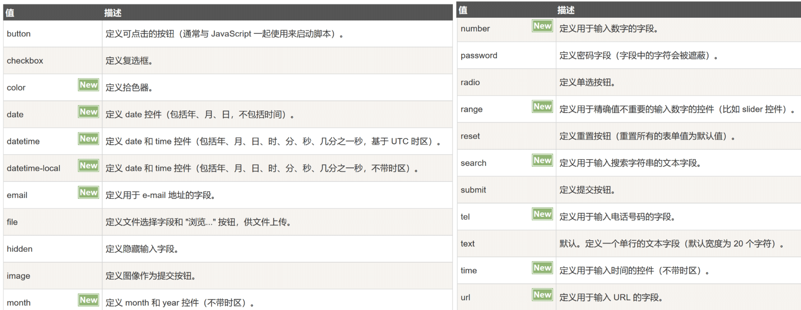

  <h1 align="center"><b>HTML</b></h1>


- [CSS | Less](CSS.md)
- [JavaScript.md](JavaScript/JavaScript.md)
- [大杂烩](../../Web/sample.html)

[TOC]

<br><br>

## 关键字缩写



> 参考字典：[HTML 元素参考\_MDN ](https://developer.mozilla.org/zh-CN/docs/Web/HTML/Element)

<br>

## \<meta\> 文档级元数据元素

## Skipping

## 表单

### 概述

- 表单的属性和方法
- 

- **且：**

  - `form` 中的 `method` 的 GET 方法通常只用于搜索查询，而不是写入数据
  - 有 `name` 值才会才 URL 中有值传递

- **获取表单方式：**

  - 通过 id 获取。如 var form = document.getElementById(“form1”);
  - 通过 document.forms 可以取得页面中所有的表单。如

    ```js {.line-numbers}
    var firstForm = document.forms[0];//取得页面中的第一个表单
    var myForm = document.forms[“form2”];//取得页面中名称为"form2"的表单
    ```

### input

- **定义：**
- 

- **type** 的类型
- 

### button

### select

- 下拉内容
  ```html {.line-numbers}
  <form method="post" action="test.php">
    <span>选一个水果：</span>
    <label for="groups">
      <select id="groups" name="groups">
        <option>Banana</option>
        <option>Cherry</option>
        <option>Lemon</option>
      </select>
    </label>
  </form>
  ```

## audio

### 属性

- **只读属性**
  - `duration`：获取媒体文件的播放时长，以 `s` 为单位，如果无法获取则为 `NaN`，当**触发 `canplay` 事件后**就可以获取当前总长度
  - `paused`：判断是否已经暂停，返回 `true`/`false`
  - `ended`：判断是否已经播放完毕，返回 `true`/`false`
  - `error`：在发生了错误后，返回错误代码
  - `currentSrc`：以字符串的形式发挥正在播放或已经加载的文件，对应浏览器在 `source` 元素中选择的文件
  - `buffered`：获取当前缓冲区大小，返回 `TimeRanges` 对象
- **可控制属性**
  - `src`：指定音频的文件位置
  - `autoplay`：是否自动播放
  - `preload`：是否预加载
  - `loop`：是否循环播放
  - `controls`：显示或隐藏用户控制界面
  - `muted`：设置是否静音
  - `volume`：在 0.0 到 1.0 间的音量值，或查询当前音量值
  - `currentTime`：以 `s` 为单位返回从开始播放到目前所花的时间，也可设置 `currentTime` 的值来跳转到特定位置
- **更多属性**
  - `audioTracks`：返回表示可用音频滚到的 `AudioTrackList` 对象。
  - `controller`：返回表示音频大年媒体控制器的 `MediaController` 对象。
  - `crossOrigin`：设置或返回音频的 `CORS` 设置
  - `defaultMuted`：设置或返回音频默认是否静音
  - `defaultPlaybackRate`：设置或返回音频的默认播放速度
  - `mediaGroup`：设置或返回音频叔叔的美肌组合的名称
  - `networkState`：返回音频的当前网络状态
  - `playbackRate`：设置或返回音频的播放速度。
  - `seekable`：返回标识音频可寻址部分的 `TimeRanges` 对象
  - `seeking`：返回用户当前收正在音频中进行查找。
  - `textTracks`：返回标识文本滚到的 `TextTrackList` 对象

### 方法事件

- **方法**
  - `load()`：加载音频、视频软件
  - `paly()`：播放
  - `pause()`：暂停
  - `canPlayType(obj)`：测试饭后指定指定的 `Mime` 类型的文件
  - `load()`：重新加载音频元素
  - `getStartDate()`：返回新的 `Date` 对象，表示当前时间线偏移量。
  - `fastSeek()`：在音频播放器中指定播放时间。
  - `addTextTrack()`：想音频添加新的文本轨道。
- **事件**
  - `loadstart`：客户端开始请求数据
  - `progress`：正在播放的时候不停触发，如果暂停不会触发，触发的时间间隔比较大
  - `play`：`play()`和 `autopaly` 播放时，类似事件 `onplaying`
  - `pause`：`pause()`方法触发时
  - `ended`：当结束播放时
  - `timeupdate`：当前播放时间发生改变的时候，播放中常用的时间处理，如果暂停不会触发，触发的时间间隔比较小
  - `canplaythrough`：歌曲已经载入完成
  - `canplay`：缓冲至可播放状态，类似事件 `onloadedmetadata`
  - `onloadedmetadata`：当元数据（比如分辨率和时长）被加载时运行的脚本
