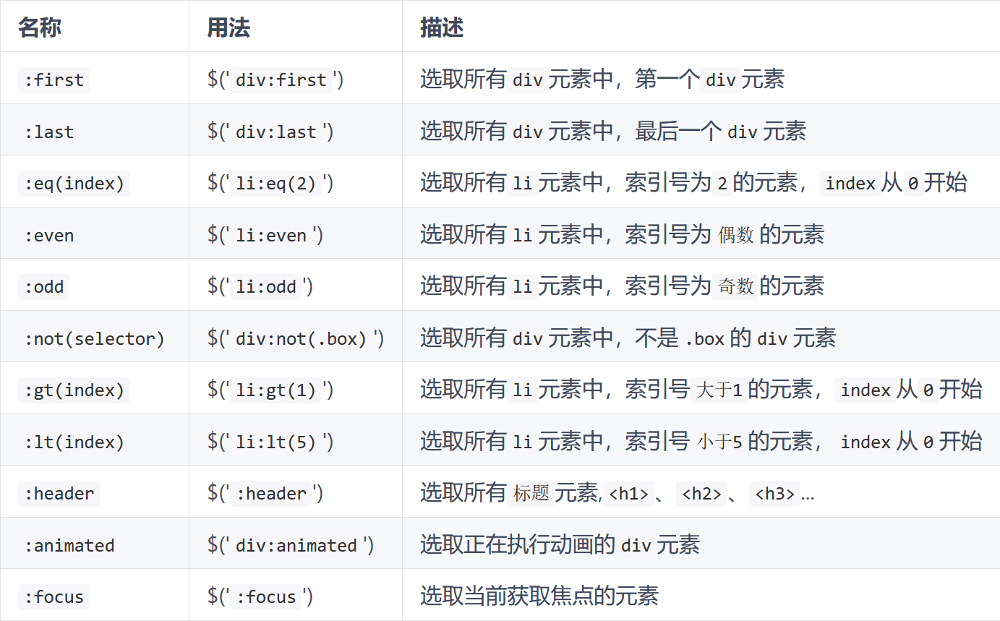
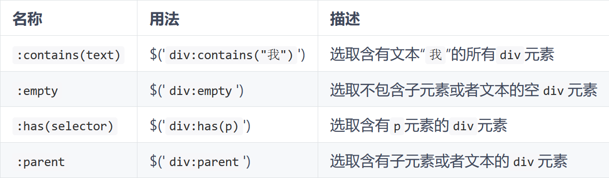
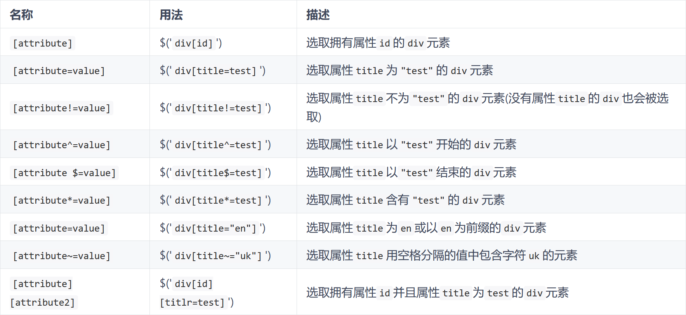
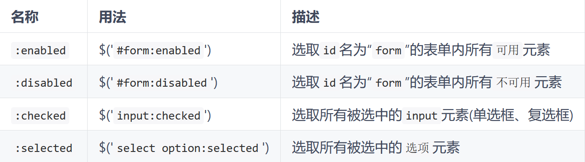
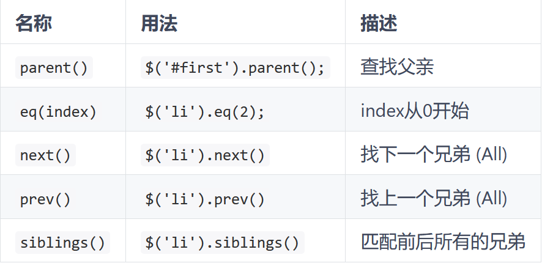
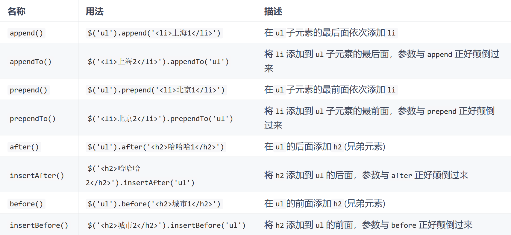
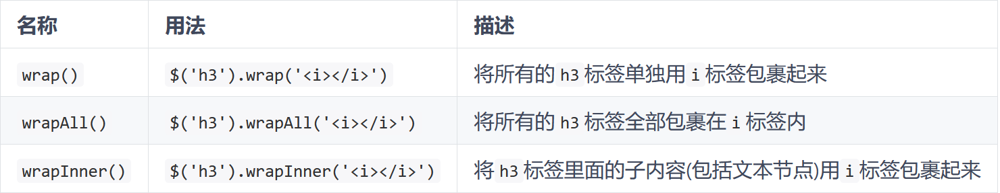

# {{ $frontmatter.title }}

<p style="font-size: 32px; font-weight: bold;">目录</p>

<!-- @import "[TOC]" {cmd="toc" depthFrom=2 depthTo=6 orderedList=false} -->

<!-- code_chunk_output -->

- [函数入口](#函数入口)
- [选择器](#选择器)
  - [过滤器](#过滤器)
  - [方法](#方法)
- [节点](#节点)
  - [节点操作](#节点操作)
  - [attr 属性](#attr-属性)
  - [CSS 样式](#css-样式)
  - [事件](#事件)
  - [取值](#取值)
- [动画](#动画)
- [Ajax](#ajax)
- [参考](#参考)

<!-- /code_chunk_output -->

<br>
&emsp;

## 函数入口

`window.onload()` 方法是等到页面中所有元素加载完毕之后，才执行，即 `javascript` 此时才可以访问网页中的任何元素。而 jQuery 使用 `$(document).ready()` 方法，可以在 DOM 载入就绪时就对其进行操纵并调用执行它所绑定的函数。也就是说在 jQ 中，不需要等待所有图片加载完再执行。

但是就会有个问题，当获取图片宽高的时候，可能获取不到。不过 jQ 中单独提出了一个页面加载的方法——`load()` 方法，如果这个处理函数绑定给 `window` 对象则会在所有内容加载完毕之后触发，且不会被覆盖：

```js {.line-numbers}
$(window).load(function () {
  // 执行代码
});
```

上面的代码，等同于 js 中的：

```js {.line-numbers}
window.onload = function () {
  // 执行代码
};
```

## 选择器

返回 JQuery 对象。基本与 css 一样，也催生出了 `document.querySelector(All)`
同时，它基本不用写循环，因为 JQuery 是隐式循环，源码本身就已经实现循环了

### 过滤器

**基本过滤器**



**内容过滤器：**



**属性过滤器**



**表单过滤器**



### 方法

**选择器方法**



<br>

## 节点

### 节点操作

- **添加节点**
  

- **删除节点**
  1. `remove()`：完全删除节点
  2. `detach()`：删除，但事件绑定还在
  3. `empty()`：相当于只是 `innerHTML = "";`
- **克隆节点**
  `clone()`：默认浅拷贝，加参数 true 则深拷贝
- **替换节点：**
  `replaceWith()`
- **包裹节点：**
  

### attr 属性

- `$().attr(name | val)`：单参数时为获取，双参数为设置。设置多值时，参数为 json 对象
- `$().removeAttr()`：删除属性值，多值时空格间隔
- 而：对于 `checked、selected、disabled` 这类 boolean 类型的属性来说，不能用 attr 方法，只能用 `prop` 方法。
- `$().addClass(val)` | `$().removeClass(val)` ：只 添加 | 删除 而不是替换掉
- `$().toggleClass(val)`：切换 —— 存在则删除，不在则添加
- `$().is(val)`：判断元素是否包含某一属性

### CSS 样式

- `$().css(name | val)`：单属性名为获取，双参数为设置。设置多值时，参数为 json 对象

### 事件

- **事件监听：**
  - `$().on(event, fun)`：类同与原生的 `ele.onevent = fun`
- **事件绑定：** `$().event(fun)`：
- **事件合成：** `$().hover(enter, leaver)`，鼠标进入时触发 enter 函数，
- **阻止冒泡：** `fun(e){stopPropagation();}`
- **事件属性：**
  - `e.which`：获取点击的按键码(鼠标: e.button，键盘: e.code)
  - `e.metaKey`：获取 Ctrl 键
- **移除事件：** `$().unbind(event)`

### 取值

- `$().html()`：相当于 innerHTML，带参数则为设置
- `$().text()`：相当于 innerText，带参数则为设置
- `$().val()`：相当于 value，带参数则为设置

<br>

## 动画

- **显示 | 隐藏：**
  - `$().show(val)` | `$().hide(val)`：带参数则 淡入淡出地改变宽高和不透明度，val 为 毫秒
  - `$().fadeIn()` | `$().fadeout()`：只改透明度的淡入淡出
  - `slideUp()` 方法和 `slideDown()` 方法只会改变元素的高度，如果一个元素的 di`splay 属性值为“none”，调用 `slideDown()` 方法的时候元素由上至下延伸显示。`slideUp()` 正好相反，元素将由下到上缩短隐藏。
- **自定义：** `$().animate(params, speed, way, callback)`
  - `params`：一个包含样式和值的 json 对象，比如`{p1:"val1",p2:"val2",...}`；
  - `speed`：动画执行速度(可选)，默认 400；
  - `way`：表示过度使用哪种缓动函数(默认 `swing`，jQ 内部还支持一个 `linear`)
  - `callback`：在动画执行完之后，执行的函数(可选)。

<br>

## Ajax

<br><hr>

## 参考

> 1. [JQuery 入门[1] \_思否](https://segmentfault.com/a/1190000013677113)
> 2. [JQuery 入门[2] \_思否](https://segmentfault.com/a/1190000013677253)
