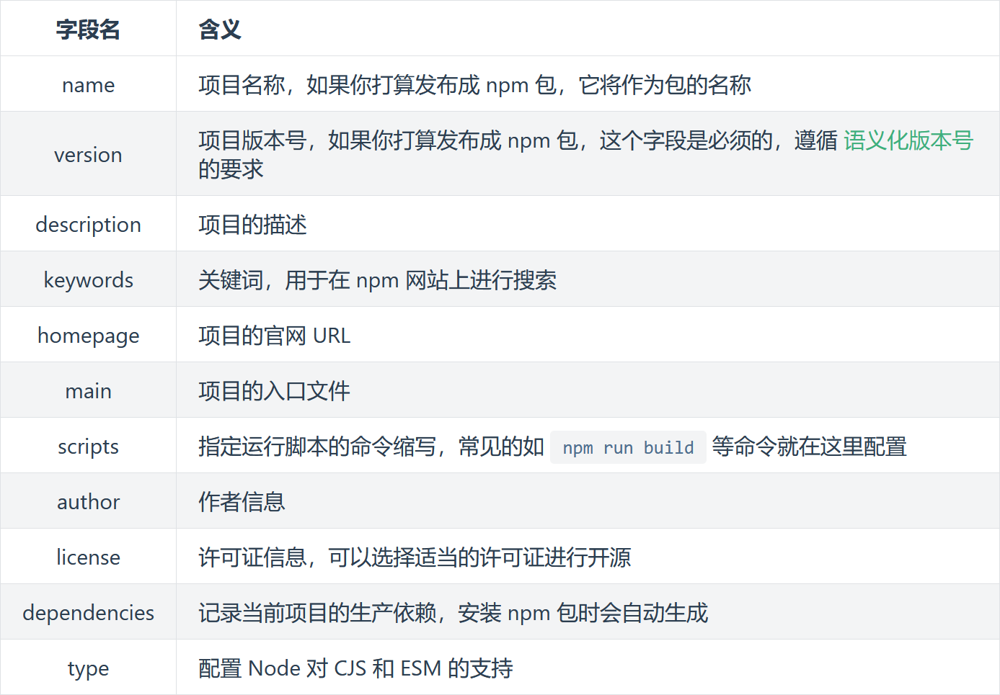

<h1 align="center"><b>Node.js</b></h1><br>

- **外链**
  
  - [JavaScript](../JavaScript/JavaScript.md)
  - [Express 框架](Express.md)

[TOC]

<br>

# Node 项目

## 初始化

- cd 到项目文件夹并运行 ↓ 后，按提示填写项目信息，就会生成 `package.json` 文件
  ```shell {.line-numbers}
  pnpm init
  rem // 选默认值则是:
  pnpm init -y
  ```
- `package.json` 文件包含的信息：
- 

- 其中最后的 `type` 字段是涉及到模块规范的支持，它有两个可选值： `commonjs` 和 `module` ，其默认值为 `commonjs` 。
  > 关于 `package.json` 的完整的选项可以在 [npm Docs](https://docs.npmjs.com/cli/v8/configuring-npm/package-json/)上查阅。

> Ref： [Node 项目如何使用 ES 模块](https://blog.csdn.net/sayUonly/article/details/122885171) &emsp; | [tsconfig.json 的配置](https://blog.csdn.net/muguli2008/article/details/122246623) &emsp; | [Node 为什么用不了 ES 模块](https://segmentfault.com/q/1010000039917414)

<br>

# 模块

## Common JS | ES Modules

- **`CommonJS`：**
  - **导出：** CJS 使用 `module.exports = {}` 语法导出模块，可以导出任意合法的 `JavaScript` 类型，例如：字符串、布尔值、对象、数组、函数等等
  - **导入：** 使用 `require` 导入模块，在导入的时候，当文件扩展名是 `.js` 时，可以只写文件名
- **`ESModules`：** 要引入 `package.json` 并设置 `"type": "module"`
  - **导出：** 在要导出的 js 类型前加 `export`
  - **导入：** `import {} from './module'`，重命名：`{mie as miemie}`
  - 但这样运行时要加上 `node --experimental-specifier-resolution=node \file_dir` 才能忽略后缀名地使用 ES 模块

## node 模块

### Buffer 缓冲区

`Buffer` 是 `Node.js` 的内置类型，它是用来表示内存中一块区域的，用以保存二进制数据。内容是以将二进制文件流表现为十六进制的 Buffer 数组

`Buffer` 可以用来表示图片、视频这样的二进制数据，另外我们从文件中读取到的也是 `Buffer` 类型的数据，从网络中接收的数据也是 Buffer 类型的数据

- **一些方法：**
  - `Buffer.alloc(len)`：开辟一个 len 个字节的内存
  - `Buffer.from(x)`：将字符串或数组转为 `Buffer` 对象，范围为 `00 ~ 0xff`
  - `Buffer.toString(decode)`：将 `buffer` 对象转换为指定编码字符串，默认为 `utf8`

### fs 文件读写

- **文件写入：** 如果不存在这个文件名，这会创建文件
  - **简单写入**
    - `fs.writeFile(file, data, [,options], callback);`
    - `fs.writeFileSync(file, data);`
    - `options` 选项
      1.  `encoding` 默认值: `'utf8'`
      2.  `mode` 默认值: `0o666`
      3.  `flag` 默认值: `'w'`
  - **流式写入** `fs.createWriteStream(path[, options])`
    - 事件监听 `open | close` eg: `ws.on('open', function(){});`
- **文件读取：** 返回的 data 为 Buffer 类型
  - `fs.readFile(file, function(err, data){})`
  - `fs.readFileSync(file, [,options])`
  - 大文件用流式读取： `fs.createReadStream(file)`
- **文件删除：**
  - `fs.unlink('./test.log', function(err){});`
  - `fs.unlinkSync('./move.txt');`
- **移动文件 + 重命名：**
  - `fs.rename('./1.log', '2.log', function(err){})`
  - `fs.renameSync('1.log','2.log')`
- **文件夹操作：**
  - `mkdir` 创建文件夹
    - `path`
    - `options`
      1.  `recursive` 是否递归调用
      2.  `mode` 权限 默认为 0o777
    - `callback`
  - `rmdir` 删除文件夹
  - `readdir` 读取文件夹
- **获取文件信息：** `fs.statSync(file)`

<br>

## 第三方模块

### Express 框架

`Node` 本身并不支持其它常见的 `web` 开发任务。如果需要进行一些具体的处理，比如运行其它 `HTTP` 动词（比如 `GET、POST、DELETE` 等）、分别处理不同 `URL` 路径的请求（“路由”）、托管静态文件，或用模板来动态创建响应，那么可能就要自己编写代码了，亦或使用 `web` 框架，以避免重新发明轮子

`Express` 是最流行的 `Node` 框架，是许多其它流行 `Node` 框架的底层库。它提供了以下机制：

- 为不同 `URL` 路径中使用不同 `HTTP` 动词的请求（路由）编写处理程序
- 集成了“视图”渲染引擎，以便通过将数据插入模板来生成响应
- 设置常见 `web` 应用设置，比如用于连接的端口，以及渲染响应模板的位置
- 在请求处理管道的任何位置添加额外的请求处理“中间件”

这些库可以实现 cookie、会话、用户登录、URL 参数、POST 数据、安全头等功能

> 详见： [Express.md](Express.md)

###

#
