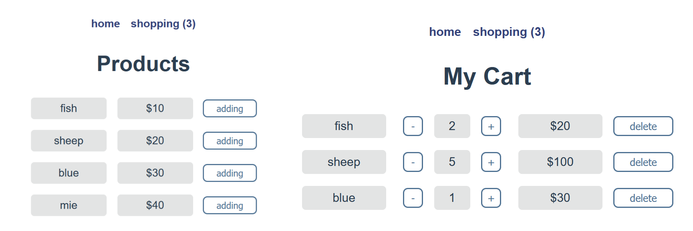
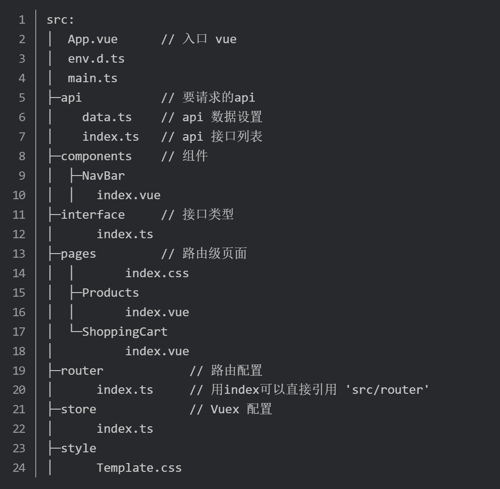
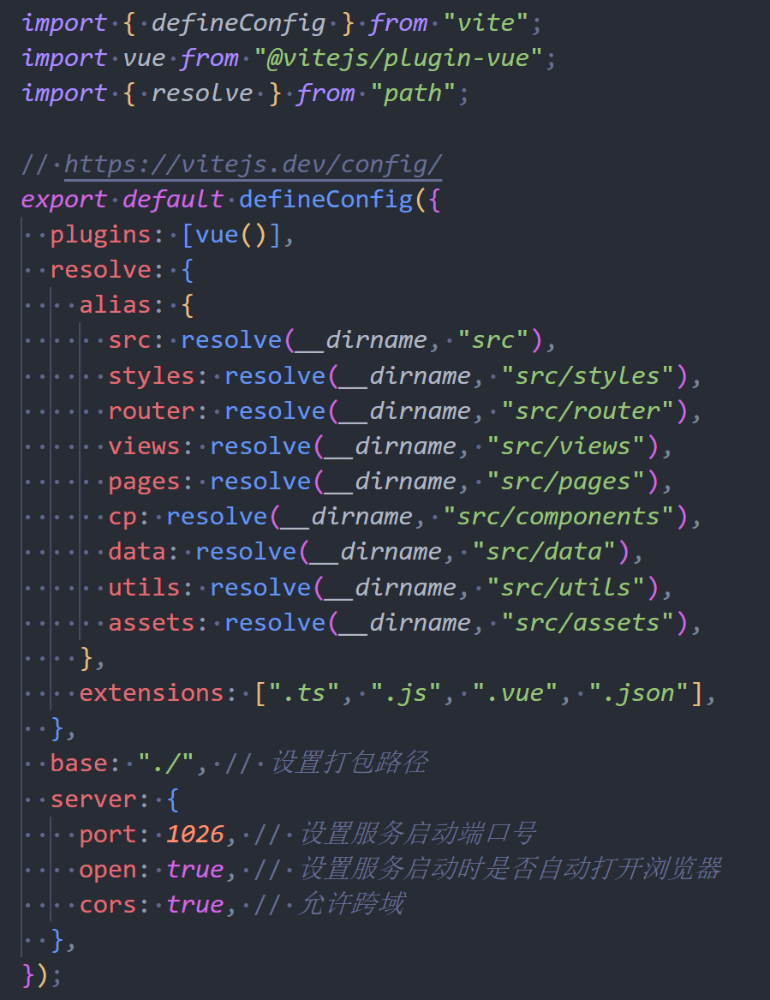

# ShoppingCart.demo

[TOC]

- 外链
  - [Vue.md](Vue.js.md)
  - [demo 源码](../../../Web/vue/ts-vite/src/App.vue)

<br>

## 介绍

主要是搭建 demo 项目时踩得亿些坑，仿造着 [掘金](https://juejin.cn/post/6918672538646102029#heading-0) 的这一篇文章开始边尝试边学习 vue3。

内容还是经典的购物车，功能是点击添加到购物车，还能增添添加的数目，虽然还没算总价钱

### 技术栈

- Vue 3.2
- Vue-router 4.0
- Vuex 4.0  //看了眼，觉得还是学 pinia好点.？
- Vite 2.9
- Typescript 4.5

### 预览

&emsp;&emsp;

 

## 创建项目

### 初始化

这里使用 `pnpm` 会比较的方便，它不会重复下载之前下载过的包

```shell {.line-numbers}
pnpm create @vitejs/app [appName] --template vue-ts
cd [appName]
pnpm install
```

然后把 自带的 `helloWorld` 删掉，添加目录：

### 完善目录结构

- 添加文件：
  
- 修改 `tsconfig.json`，添加以下配置，才能在 `Typescript` 的 `import` 中省略后缀名，直接是：`import xx from "src/api"`
  ```js {.line-numbers}
  "compilerOptions": {
  // ...
  "baseUrl": "./",
  "paths": {
      "src": [ "./src/" ]
    }
  }
  ```
- 修改 `vite.config.ts`，添加别名等设置 <a href="../../../Web/vue/ts-vite/vite.config.ts">demo 中的 vite.config.ts</a>。参考 [vite 官方的配置文件](https://cn.vitejs.dev/config/)
  

## 添加路由

- &emsp;&emsp;
  ```shell {.line-numbers}
  pnpm i vue-router@4
  ```
- 在 `main.ts` 中挂载路由
- 编辑路由出口 `router/index.ts`

  ```ts {.line-numbers}
  import { createRouter, createWebHistory, RouteRecordRaw } from "vue-router";
  import Home from "pages/Products/index.vue";

  const routes: Array<RouteRecordRaw> = [
    {
      path: "/",
      name: "home",
      component: Home, // 默认主界面
    },
    {
      path: "/shopping", // domain/shopping
      name: "shopping",
      component: () => import("pages/ShoppingCart/index.vue"), // 引用自pages
    },
  ];

  const router = createRouter({
    history: createWebHistory(),
    routes,
  });

  export default router;
  ```

- 在 `<template>` 中显示路由界面： `<router-view />`

## 添加 Vuex

&emsp;&emsp;

- ```shell {.line-numbers}
  pnpm install vuex@next --save
  ```

## 添加 Api

可以先用 `Json` 来代替 `Api`

- 先定义 Api 的类型：`interface/index.ts`
  ```ts {.line-numbers}
  export interface Product {
    id: number;
    name: string;
    price: number;
    count: number;
  }
  ```
- 再去 `api/data.ts` 按类型构造数据类型

  ```ts {.line-numbers}
  import { Product } from "src/interface";

  const data: Product[] = [...];
  export default data;
  ```

- 在 `api/index.ts` 中请求 api

  ```ts {.line-numbers}
  import data from "./data";
  import { Product } from "src/interface";

  // 异步 get Products list
  export const apiGetProducts = () => {
    return new Promise<Product[]>((resolve) => {
      // 模拟请求
      setTimeout(() => {
        resolve(data);
      }, 800);
    });
  };
  ```

## 界面设计

- `App.vue` 顶栏 `nav-bar` 用于界面的跳转 | 然后再在 `.body` 里展示数据
  ```html {.line-numbers}
  <template>
    <nav-bar :count="count"></nav-bar>
    <div class="body">
      <router-view />
    </div>
  </template>
  ```

## Vue3 语法

感觉学得多也比较重要的还是 vue3 本身的语法

### Products.vue

- 循环输出数据不多说，用 `v-if` 判断数据加载的完成来呈现数据与 `loading.gif`
- 主要地使用 `<script setup>` 来减少代码量，但感觉这样函数式编程的思想变得尤为重要，不然整体上的逻辑反而会乱 参考：[掘金\_setup 语法糖](https://juejin.cn/post/7078865301856583717)

### Shopping.vue

## Vuex
