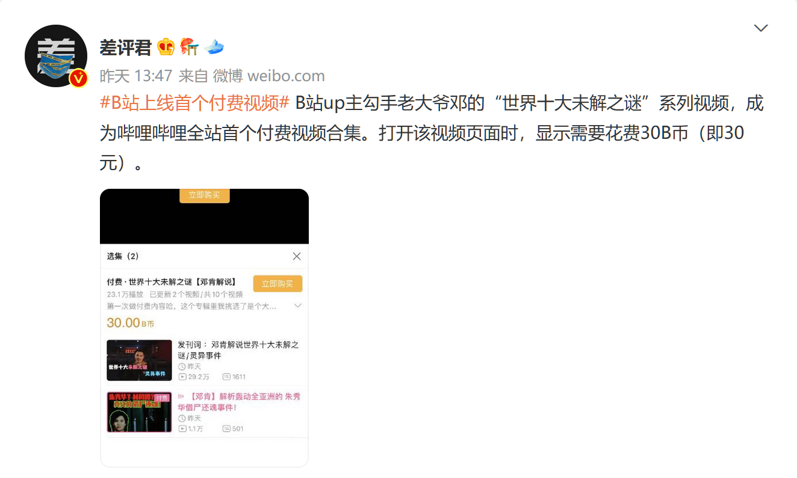
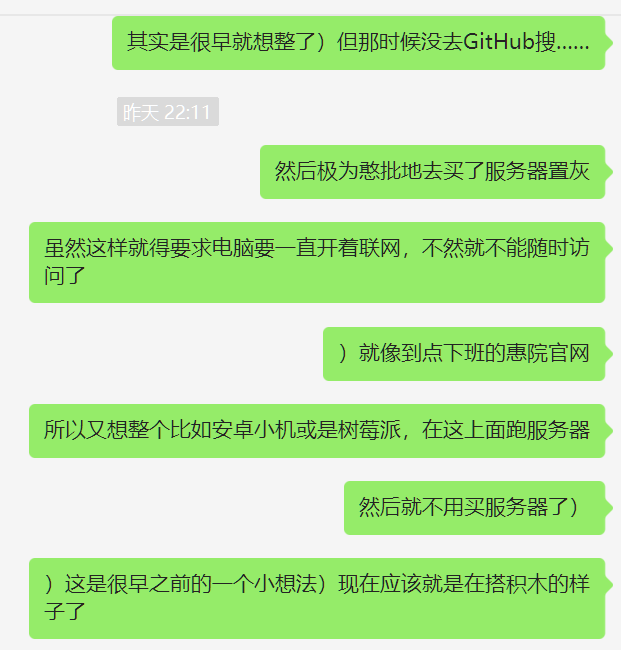
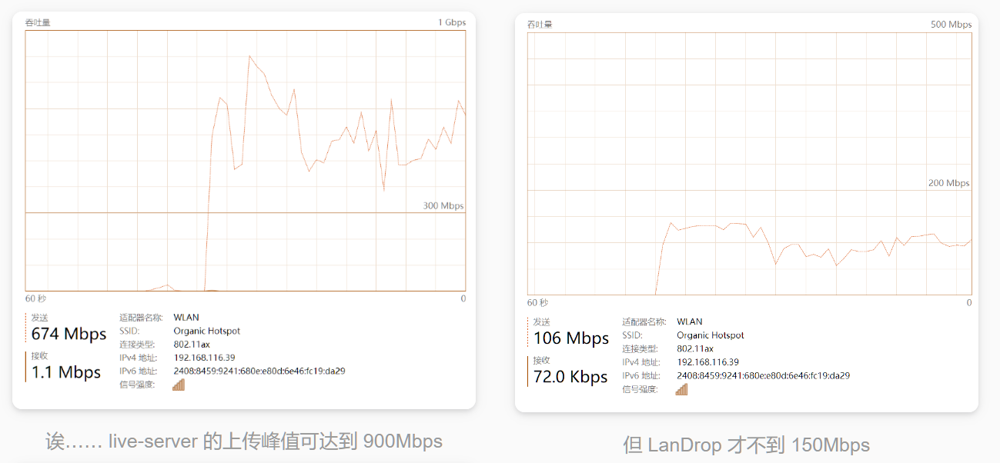
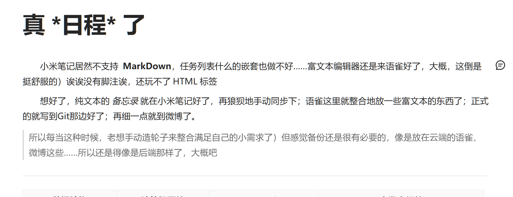

 

## 22-06

### 在这之前...

- **文章：**   [Canvas 资源](https://github.com/chinaBerg/awesome-canvas) 、 [MDN 伪类和伪元素](https://developer.mozilla.org/zh-CN/docs/Learn/CSS/Building_blocks/Selectors/Pseudo-classes_and_pseudo-elements#%E5%8F%82%E8%80%83%E8%8A%82) 、 [隼鸟 2 号：首次发现地外氨基酸？](https://weibo.com/ttarticle/p/show?id=2309404781329462984737)

 

### 06-20

- **dashboard：**
  - VsCode：`11h20m` | Firefox：`5h52m`
- **文章 | 文档：**   [Axios 文档][06-20_1] 、 [使用 Typescript 开发 Node.js 项目][06-20_2] 、 [Express 框架 文档](http://expressjs.com/zh-cn/) 、 [用 Node 写一个 APi 接口](https://www.jianshu.com/p/44149ac15b40) 、 [还算可以的 Node 文章 ](https://brucecai55520.gitee.io/bruceblog/notes/nodejs/Node.html) 、 [输入 URL 到显示过程发生了什么](https://segmentfault.com/a/1190000013662126) &emsp;
- **其他：**
  - 先是凌晨的 [innei.ren 的毕业](https://innei.ren/notes/123)，看了会 [起码课的 Promise](https://www.bilibili.com/video/av712155832) 的异步，终于是由 [50 个项目的 github 查询](https://50projects50days.com/projects/github-profiles) 补了 `ajax | Axios`
  - 艰难地尝试用 ts 配置 `Node` 的工程项目，更多的还是在模块的导入......终于是用 `pnpm i @types/Node` 才能在 ts 中使用 `Node` 自带模块（import）
  - 然后在 [ts 项目](https://github.com/Organic-Fish/FishCode/tree/master/Web/TypeScript/ts-fish) 下，用 `HTTP` 模块整出了个 `API` 服务器，并结合 `axios` 成功地获取到了数据
  - 顺便地在 [起码课的 ExpressJs](https://www.bilibili.com/video/av250818016) 项目中，终于是搞明白了 “路由” 的一些概念，以及 `ExpressJs` 框架的...... 所以，不要跳着来，Vue 之前还得是 Node
  - 顺便的一个 Node 工具： `pnpm i nodemon`，它将监测文件的改动来刷新项目，就不用每次改动都手动重启项目了

[06-20_1]: https://www.axios-http.cn/
[06-20_2]: https://segmentfault.com/a/1190000007574276

 

### 06-21

- **dashboard:**
  - VsCode： `3h36m` | FireFox： `4h6m`
- **文章 | 文档：**   [用户代码片段生成器](https://snippet-generator.app/) 、 [JS 注释描述](http://yuri4ever.github.io/jsdoc/) 、 [代码规范](http://alloyteam.github.io/CodeGuide/) 、 [在线的网易云音乐 API 服务器](https://ping-music-api.vercel.app/)
- **社交平台**
  - B 站果然整付费视频了...... 之前爬到的视频 APi：`GET https://api.bilibili.com/x/player/v2?cid=xx&aid=xx&bvid=xx`，中就有一个莫名的返回结果：`preview_toast "为创作付费，购买观看完整视频|购买观看"`

 

  来自：差评君

 

### 06-22

- **dashboard:**
  - VsCode：`7h40m` | FireFox：`5h`
- **文章 | 文档：**   [Node 项目如何使用 ES 模块](https://blog.csdn.net/sayUonly/article/details/122885171) 、 [tsconfig.json 的配置](https://blog.csdn.net/muguli2008/article/details/122246623) 、 [GitHub Node 前后端项目](https://github.com/shi-jin/myhoutai) 、 [Cors 跨源资源共享](https://developer.mozilla.org/zh-CN/docs/Web/HTTP/CORS)
- **流水：**
  - 终于算是解决了在 ts 中使用 ES 模块但编译到 js 后却用不了的窘况：[为什么用不了 ES 模块](https://segmentfault.com/q/1010000039917414) ......只能说官方没做好...？ 最后还得在 `Node` 之后加句编译选项，整到 `nodemon` 就是 `"serve": "nodemon --exec \"Node --experimental-specifier-resolution=Node ./build/main\""`
  - 主要是在补 Node 了，感觉主要还是先搞定 Node 服务器(`express`)的问题，好在是找到了个用 Node 整前后端的项目。那感觉目前就是要 ——
    - 先是 `node-ts` 后端部署好 API 服务器，同时连上 MySQL
    - 前端先是 `html` 加上 `sass` 和 `css` 框架、ts 代替 js
    - 项目先是一个后台管理系统，差不多时再接上网易云的 API，和网易云的静态界面
    - 最后才上 `Vue` 框架补齐

 

### 06-23

- **dashboard:**
  - VsCode：`6h17m` | Firefox：`2h48m`
- **文章 | 文档：**   [Express 入门项目](https://juejin.cn/post/7022539322670710798)
- **流水：**
  - 主要还是用着 `Express + ts` 写了个 `api` 服务器，对本地 `json` 文件增删改查似乎都可以用，`PostMan` 还挺好诶

 

## 22-07

### 07-06

- **dashboard:**
  - VsCode：
- **文章 | 文档：**   [VsCode 中使用 Eslint](https://www.cnblogs.com/Jamie1032797633/p/11125786.html) 、 [从零开始配置 TypeScript 项目](https://juejin.cn/post/6856410900577026061) 、 [Eslint 中文文档](http://eslint.cn/docs/user-guide/configuring) 、 [tsconfig 的一些配置](https://yesifang.com/zh/TypeScript%E7%B3%BB%E5%88%97%E6%95%99%E7%A8%8B/c2fff071/)

 

### 07-10 ~ 11

- **dashboard:**
  - VsCode： `8h10m`
- **文章 | 文档：**   [一些 Web 的聚合文档](https://www.icoderoad.com/) 、 [真丶 Bootstarp 中文文档](https://www.bootstrap.cn/doc/book/2.html) 、 [font-awesome@6.1](https://fontawesome.com/) 、 [可以试一试的 JS Web Projects](https://vanillawebprojects.com/#projects) 、 [Sass 教程](https://juejin.cn/post/7055101823442485255)
- **社交平台**
- **流水：**
  - 补了 git，整了分支和一个 `pull request`
  - 趁着买一送一和史低补上了 `Minecraft`！顺便也在 Wiki 补了点基础的，像是版本特性之类的。甚至之前对 MC 的认知还在 `1.8.0` 左右 hh（按版本号的话，破坏性更新的 `2.0.0` 什么时候出 \\Doge）
  - 忘记原因地要找回微博的裂图，然后发现它的原理应该是检测到是“违规图片”后，将链接重定向到 [裂图](https://ww4.sinaimg.cn/images/default_s_large.gif)。但原图还在图床上，改改图床链接就好：
    - 挂图链接（可在 F12 看到）：`https://wx2.sinaimg.cn/orj360/xxx.jpg`
    - 只要将 `/wx(\d)/gm` 改为 `ww$1`，`orj360` 改为原图大小的 `large` 就行。
    - 用 axios 请求到微博详情的 Api：`https://weibo.com/ajax/statuses/show?id=`，其中 id 值为微博原链接 `https://weibo.com/用户id/博文id` 中的 `博文 id`。再把获取到的原图链接再请求下来转存成本地文件就好。码：[一些 Temp.md](../TempCoder.md#大眼仔，你坏事干净！)
  - 学了点 Sass，好玩诶，并且终于上了 `Bootstarp` 和 `font-awesome`，开始筹备起聚合音乐了

 

## 22-08

### 08-01 ~ 10

- **dashboard:** `WakaTime Error`
- **文章 | 文档：**   [C++ 右值引用 && 与 move](https://zhuanlan.zhihu.com/p/335994370)

 

## 22-09

### 09-15

- **dashboard:** VsCode： ``
- **流水：**
  - [希望从这个视频开始，你能理解色彩科学【差评君】][09-15-01]

[09-15-01]: https://www.bilibili.com/video/BV1kD4y1v77R

 

### 九月底

- **dashboard:** VsCode： `7h`
- **文章 | 文档：**   [Sakana Widget](https://github.com/dsrkafuu/sakana-widget)
- **流水：**
  - 最近在补一些硬件插口的知识了，像是一直以来都在略略看的 USB、PD、DP 之类的和他们的协议，再就是音视频的一些规格和一些计算： [一些接口及协议](../../CSBase/Hardware/Interface_Protocol/README.md)
  - 再者就是突然想把 _Sakana~_ 给搬到首页上，但好像不小心忘得太多了，导致最终整了六七个小时
  - 首先是作者有发 NPM 包： `pnpm install --save sakana-widget`，然后发现好像不能直接插到 md 里。**那是因为：** Vuepress 先是转为 Vue 再打包到 HTML 的，而 md 的内容就被编译到 Vue 的 `<Template>` 里了，那看起来是要么把 md 当 Vue 写，要么引入 Vue 组件了
  - 比较舒服优雅的方式当然是选择 _引入组件_ 啦）但就此掉大坑里了。先是 ts 忘太多了，然后 Vue 的写法又不大记得…… 磨蹭了好久…… 最开始被绊倒的居然还是 ts 的 `__dirname`，但虽然翻了源码，但还是没想到带的 `@vuepress/utils` 就把这个给封装好了，但一开始库然既没查 API 又没输出试探……
  - 上完下午的课回来就着手于再 md 里插 Vue 组件了，但又还是兜兜转转地在 [官方文档](https://v2.vuepress.vuejs.org/zh/reference/plugin/register-components.html#componentsdir) 里找到了说明……
  - 但这还不是最大的问题，居然是 dev 里没问题但就死活 build 不了……但那个时候 **查找定位 Bug 的方式** 也太不对了……最后又转了几圈回到 _官方文档_ 里就有提到 [Vuepress clientOnly](https://v2.vuepress.vuejs.org/zh/reference/components.html#clientonly) 的特性。
  - 还是出现在 `Sakana` 的源码用到了 DOM，而且还不是 `type: module`，就这两个问题搞了几十分钟……
  - 最后还是日常的组内输出及试图指引
  - **但蛋旦：** 还是那个很重要的问题，一个又是跳得太快了，基础的前置知识没补上就大搞，就很浪费时间；以及一直以来的遇到问题时的解决方法都太不对劲了，实在是没有那个敏锐的意识……

 

## 22-10

### 10-02

- **dashboard:** VsCode： ``
- **文章 | 文档：**   [20 年 JavaScript | JS 发展史](https://cn.history.js.org/) 、 [Element-Plus Vue3 框架](https://element-plus.gitee.io/zh-CN/)
- **流水：**
  - 嗨虽然就不该跳着做的，但还是用 el-vue3 整了个 [Hash 密码生成器](https://organicfish.top/HashPW/)，但也不大对，像是特殊字符大小写都没整上，没有浏览器推荐的有内味，但又想整出 Hash 的感觉……
  - 那还是重新从 JavaScript 开始吧

 

### 10-045

- **dashboard:** VsCode： ``
- **文章 | 文档：**   [localtunnel 内网穿透](https://github.com/localtunnel/localtunnel)
- **流水：**

  - 内网穿透……如果早知道……但那时候连 Node 都还不知道吧……害，还得是先观望观望
  

   

   还得是GitHub
  

  - 但有个新发现诶，为什么 `live-server` 更胜一筹呢，那就得挖坑去看看网络 WiFi 方面了诶
  
 

    <code>live-server</code>与<code>LanDrop</code>的对比
  

  - 感觉感觉……还是记不住啊
  
 

    放语雀上了
  

  - 但又是摸了又摸……大都是在 _逛街_ 找找该怎么干上了，反正就是被一堆信息填满了
  - 那就明天开始吧））

 

### 10-06

- **dashboard:** VsCode： ``
- **文章 | 文档：**   [State of JS](https://2021.stateofjs.com/zh-Hans/)、 [Tailwind.css](https://tailwindcss.com/) 、[蓝湖](https://lanhuapp.com/)、 [Svelte.js](https://www.sveltejs.cn/)、 [Lodash.js](https://www.lodashjs.com/)
- **流水：**
  - 噢噢补完了久仰大名的 **ReLIFE**，以及 **24 小时核酸常态化**，然后又只是在逛街了……
  - 感觉还是好多东西，_Tailwind CSS_ 看着是有些强，但感觉现在还是先观望看看以及补完基础部分先，不着急……）是吧
  - 果然是有从 _UI 设计图到代码_ 的工具 —— 蓝湖，但还是先收藏看看先把
  - 突然又有一个前端的框架 —— `Svelte.js`，似乎挺受欢迎……？
