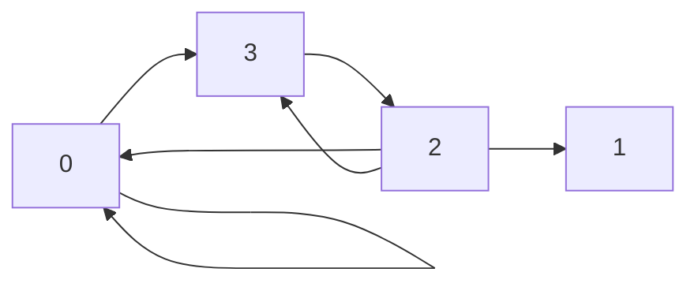
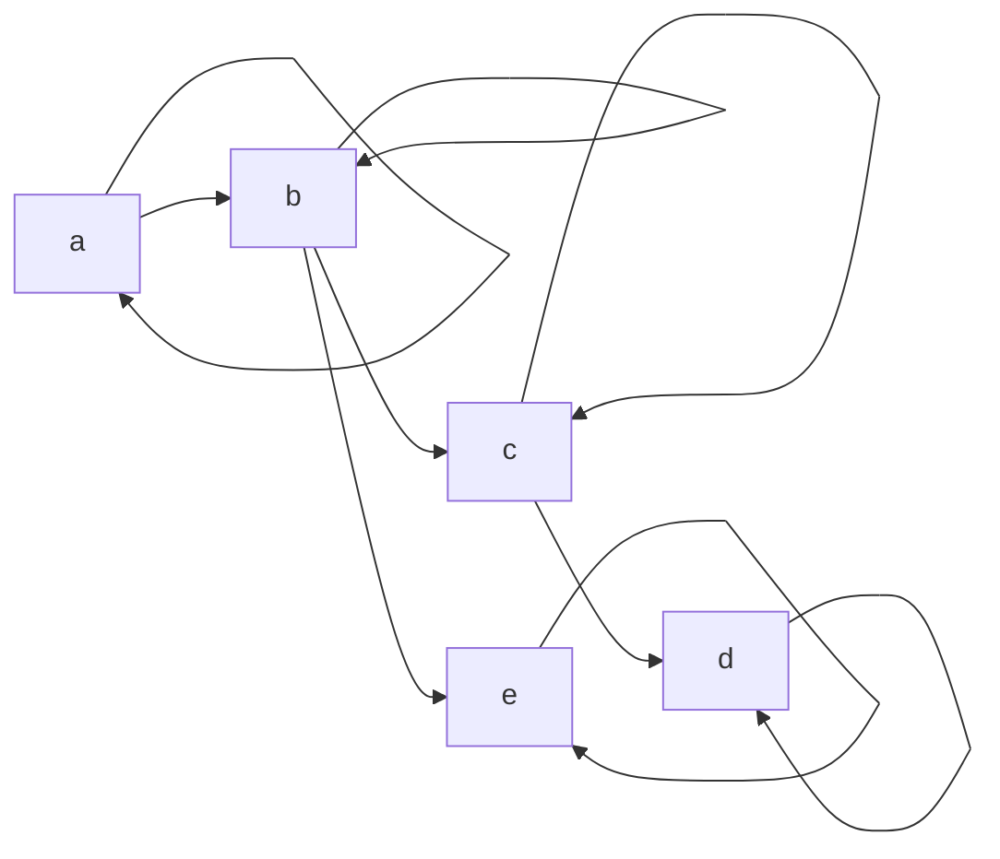
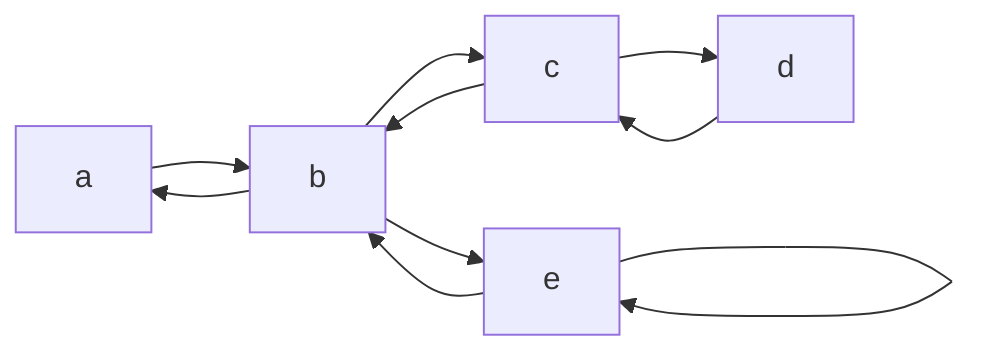
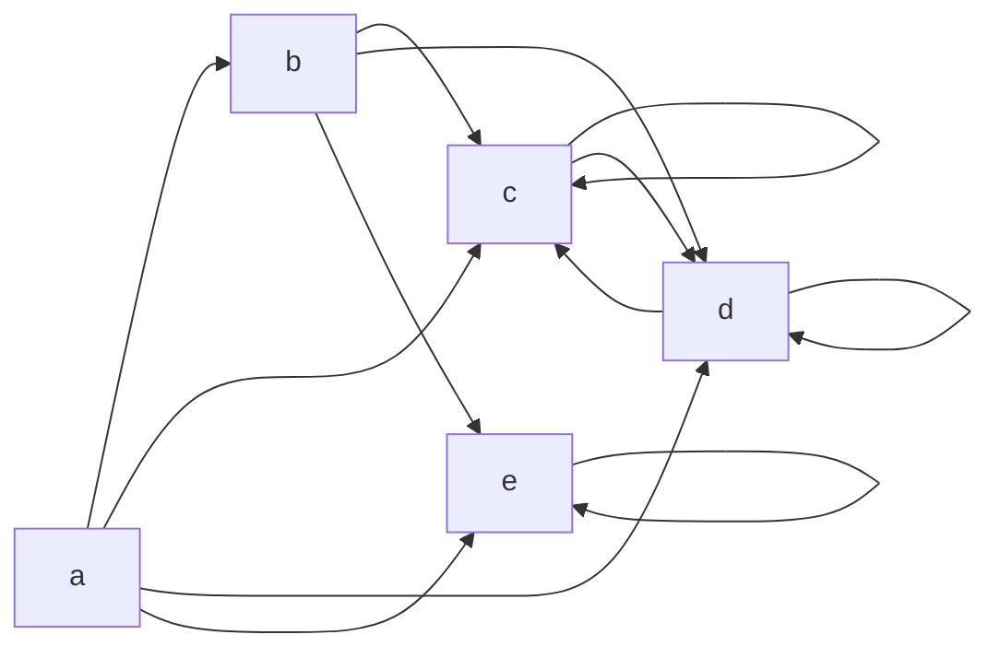
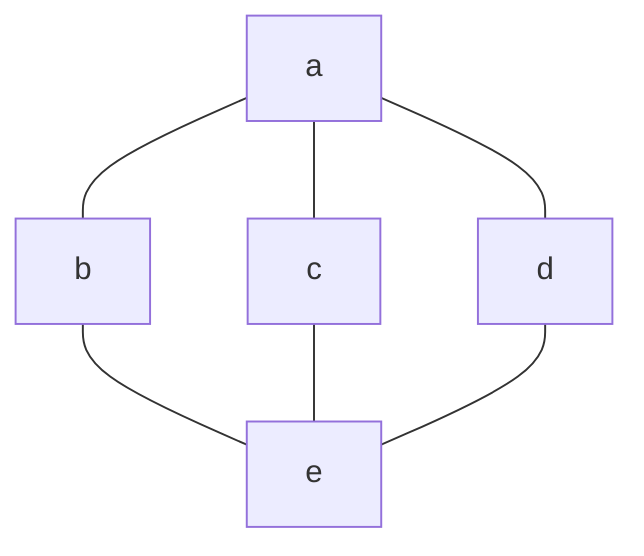
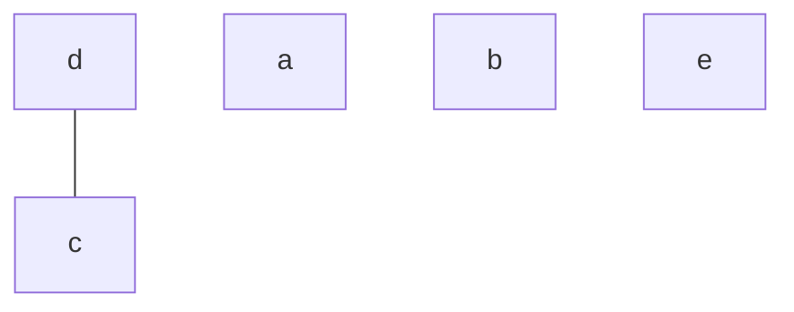

# 临时的 $\LaTeX$ 码

<!-- @import "[TOC]" {cmd="toc" depthFrom=1 depthTo=6 orderedList=false} -->

<!-- code_chunk_output -->

- [临时的 $\LaTeX$ 码](#临时的-latex-码)
  - [三角函数](#三角函数)
  - [第一次离散数学作业](#第一次离散数学作业)
  - [还是离散作业](#还是离散作业)
  - [第四章 一阶逻辑基本概念(章节练习)](#第四章-一阶逻辑基本概念章节练习)
  - [离散 11-11](#离散-11-11)

<!-- /code_chunk_output -->

## 三角函数

$$
% 三角函数_定义
\begin{align*}
\text{正三角函数：}\\
&\sin\theta =y ,\ \cos\theta =x ,\ \tan\theta = \frac{y}{x} \\
&\sec\theta = \frac{1}{x}, \ \csc\theta = \frac{1}{y}, \ \cot\theta= \frac{x}{y} \\
\text{反三角函数：}\\
&\arcsin y = \theta \\
&f(x)=\arcsin(x),\ (x\in\left[-1,1 \right],\ f(x)\in \left [ -\frac{\pi}{2} ,\frac{\pi}{2}  \right ] )
\end{align*}
$$

$$
\begin{align*}
     & \cos 2x = 2\cos^2 x - 1 \quad \cos x + 1 = 2\cos^2 \frac{x}{2} \\
     & \sin^2 x +\cos^2 x = 1 \quad \cot^2 x+1 = \csc^2 x                                  \\
     & \tan^2 x+1 = \sec^2 x \quad \tan x = \frac{\sin x}{\cos x} = \frac{\sec x}{ \csc x} \\
     & u = \arcsin x \to x=\sin u \quad 1-x^2 = \cos^2 x                                   \\
     & \sin\arcsin x = x \quad \cos\arcsin = \sqrt{1-x^2}                                  \\
\end{align*}
$$

## 第一次离散数学作业

$\textbf{1. \quad 证明：} \mathbf{p \to (q \to r) \Leftrightarrow p \wedge q \to r}$

$$
\begin{align*}
  \text{证：令  \quad} &A = p \to (q \to r) \\
    &\Leftrightarrow p \to (\lnot q \vee r) \\
    &\Leftrightarrow \lnot p \vee (\lnot q \vee r) \\
    &\Leftrightarrow r \vee (\lnot q \vee \lnot p) \\
    &\Leftrightarrow r \vee \lnot (p \wedge q) \\
    &\Leftrightarrow p \wedge q \to r \\
  \therefore p \to &(q \to r) \Leftrightarrow p \wedge q \to r
\end{align*}
$$

 

$\textbf{2. \quad 证明：} \mathbf{A\oplus 1 \Leftrightarrow \lnot A}$

$$
\begin{align*}
  \text{证：令  \quad} B &= A \oplus 1 \\
    &\Leftrightarrow (\lnot A \wedge 1) \vee (A \wedge 0) \\
    &\Leftrightarrow \lnot A \vee 0 \\
    &\Leftrightarrow \lnot A \\
    \\
  \therefore A \oplus &1 \Leftrightarrow \lnot A
\end{align*}
$$

 

$\textbf{3. 证明：} \mathbf{A \oplus B \Leftrightarrow (A \vee B)\wedge\lnot(A\wedge B)}$

$$
\begin{align*}
  \text{证：令 \quad} X&=(A\vee B)\wedge \lnot(A\wedge B) \\
    &\Leftrightarrow \lnot(A\wedge B) \wedge A \vee \lnot(A\wedge B)\wedge B \\
    &\Leftrightarrow (\lnot A\vee\lnot B)\wedge A \vee(\lnot A\vee\lnot B)\wedge B \\
    &\Leftrightarrow (\lnot B \wedge A)\vee 0 \vee(\lnot A\wedge B) \vee 0 \\
    &\Leftrightarrow (\lnot B\wedge A)\vee(\lnot A\wedge B) \\
    &\Leftrightarrow A \oplus B
\end{align*}
$$

 

$\textbf{4. 证明：} \mathbf{(p\vee q)\wedge(\lnot p\vee r)\wedge(q\vee r)\Leftrightarrow (p\vee q)\wedge(\lnot p\vee r)}$

$$
\begin{align*}
  \text{证：令 \quad} A&=(p\vee q)\wedge((\lnot p\vee r)\wedge(q\vee r)) \\
  &\Leftrightarrow (p\vee q)\wedge(\lnot p\wedge q \vee r) \\
  &\Leftrightarrow ((p\vee q)\wedge(\lnot p\wedge q))\vee ((p\vee q)\wedge r) \\
  &\Leftrightarrow (\lnot p\wedge q)\vee(p\wedge r)\vee(q\wedge r) \\
  \\
  \text{令 \quad} B&=(p\vee q)\wedge(\lnot p\vee r) \\
  &\Leftrightarrow \lnot p\wedge(p\vee q)\vee r\wedge(p\vee q) \\
  &\Leftrightarrow (\lnot p\wedge q)\vee(p\wedge r)\vee(q\wedge r) \\
  \therefore A \Leftrightarrow B &\text{原命题得证}
\end{align*}
$$

## 还是离散作业

$\textbf{1. 用主范式判断下述公式的类型：} \quad (p\wedge q \to r)\to(p\to r)\wedge(q\to r)$

$$
\begin{align*}
  \text{证： 原式 \quad} &\Leftrightarrow \lnot(\lnot(p\wedge q)\vee r)\vee(\lnot p\vee r)\wedge(\lnot q \vee r) \\
  &\Leftrightarrow (p\wedge q\wedge \lnot r)\vee(\lnot p\wedge\lnot q)\vee r \\
  &\Leftrightarrow (p\wedge q\wedge \lnot r)\vee(\lnot q\wedge \lnot p)\wedge(r\vee\lnot r)\vee(q\vee\lnot q)\wedge(p\vee\lnot p)\wedge r \\
  &\Leftrightarrow(p\wedge q\wedge \lnot r)\vee(\lnot p\wedge\lnot q\wedge \lnot r)\vee(p\wedge q\wedge r)\\ & \quad \quad \quad \quad \quad\vee(p\wedge\lnot q\wedge r)\vee(\lnot p\wedge q\wedge r)\vee(\lnot p\wedge\lnot q\wedge r) \\
  &\text{由此主析取范式可知：} 6 < 2^3  \quad\text{，即为} \textbf{可满足式}
\end{align*}
$$

$\textbf{2. 判断：} \mathbf{(p\wedge q)\vee(\lnot p\wedge r)\vee(q\wedge r)} \textbf{ \quad与 \quad} \mathbf{(p\wedge q)\vee(\lnot p\wedge r)} \textbf{是否等值}$

$$
\begin{align*}
  \text{解：由对偶式互等值可得，}\text{原命题可转化为} \\
  \text{证明：} (p\vee q)\wedge(\lnot p\vee r)\wedge(q\vee r)\Leftrightarrow (p\vee q)\wedge(\lnot p\vee r)\\
\end{align*}
$$

 

$\textbf{3. 应用题：}$

$$
\begin{align*}
  \text{解： \quad 设派他们去时的}&\text{命题分别为 \quad} a,b,c,d,e \text{，则由题意得：} \\
  \text{设最终的情况为： \quad} A&= (a\to b)\wedge\lnot(d\wedge e)\wedge(b\vee c)\wedge(c\oplus d)\wedge(e\to a\wedge b) \\
  &\Leftrightarrow (\lnot a\vee b)\wedge(\lnot b\vee\lnot e)\wedge(b\wedge c)\wedge(c\wedge\lnot d\vee\lnot c\wedge d)\wedge(\lnot e\vee a\wedge b)
\end{align*}
$$

 

## 第四章 一阶逻辑基本概念(章节练习)

$\textbf{1. 将命题符号化：}$

$$
\begin{align*}
&(1) \text{令：} R(x):x \text{是人，} W(x):x \text{用左手写字，则符号化为：} \exist x(R(x) \wedge W(x)) \\
&(2) \text{令：} F(x):x \text{是素数。} E(x):x \text{是偶数，则符号化为：} \exist x(F(x) \wedge E(x)) \\
&(3) \text{令：} M(x):x\text{是金属，} L(x):x \text{是液体，}R(x,y):x \text{表示可以溶解在y中。则符号化为：} \\
& \qquad \forall x(M(x) \to \forall y(L(y) \wedge R(x, y))\\
\end{align*}
$$

$\textbf{2. } f(x,g(y)) \text{是项，} P(g(x)),  \quad\forall y(P(y) \to Q(x,y)) \text{是公式。}$

$\textbf{3. } \exist x$ 的唯一一次出现的辖域是 $P(x)$

- $x$ 的最后一次出现是自由出现，其余各次出现都是约束出现
- $y$ 的唯一一次出现是自由出现
- $x$ 既是公式的约束变元，又是自由变元

$\textbf{4. }$ 在解释 $I$ 和赋值 $v$ 下，$h(g1(a,f(x)), \quad g2(b, h(a, b, y)), x)=(1+(-3))\times(0\times(1\times0-(-2)))-3= - 3$

$\textbf{5. }$ 在解释 $I$ 和赋值 $v$ 下，对于任意实数 $y$，存在实数 $z$，使得 $y\times z=1$。这个命题是一个假命题，因为不存在实数 $z$ 使得 $0\times z=1$

$\textbf{6. }$

$$
\begin{align*}
\forall x& \forall y\forall z (P(x, y)\wedge P(y, z) \to P(x, z)\\
  &= \forall y\forall z(P(a, y)\wedge P(y, z)\to P(a, z)) \wedge \forall y\forall z(P(b, y)\wedge P(y, z)\to P(b, z)) \\
  &= \forall z(P(a, a)\wedge P(a, z)\to P(a, z)) \wedge \forall z(P(a, b)\wedge P(b, z)\to P(a, z)) \\
  & \qquad \wedge \forall z(P(b, a)\wedge P(a, z)\to P(b, z))\wedge \forall z(P(b, b)\wedge P(b, z)\to P(b, z)) \\
  &= 1 \wedge \forall z(P(a, b)\wedge P(b, z)\to P(a, z)) \wedge \forall z(P(b, a)\wedge P(a, z)\to P(b, z)) \wedge 1 \\
  &= \forall z(P(a, b)\wedge P(b, z)\to P(a, z)) \wedge \forall z(P(b, a)\wedge P(a, z)\to P(b, z)) \\
  & = (P(a, b)\wedge P(b, a)\to P(a, a)) \wedge (P(a, b)\wedge P(b, b)\to\\
  &\qquad P(a, b))\wedge (P(b, a)\wedge P(a, a)\to P(b, a)) \wedge (P(b, a)\wedge P(a, b)\to P(b, b)) \\
  & =(0 \wedge 1 \to 1) \wedge (0 \wedge 0 \to 0) \wedge (1 \wedge 1 \to 1) \wedge (1 \wedge 0 \to 0) \\
  & =1 \\
\end{align*}
$$

$\textbf{7. }$

- 给定使 $P(x) \to (\forall xQ(x, y) \to P(y))$ **为真的解释** $I_1$ 和 $I_1$ 中的赋值 $v_1$ 如下：  $D_{II}$ 为自然数集，$P(x):x$ 是奇数，$Q(x, y):x\geq y，v1(x)=v1(y)=0$
- 给定使 $P(x) \to (\forall xQ(x, y) \to P(y))$ **为假的解释** $I_2$ 和 $I_2$ 中的赋值 $v_2$ 如下：  $D_{II}$ 为自然数集，$P(x):x$ 是奇数，$Q(x, y):x\geq y，v2(x)=1, v2(y)=0$

$\textbf{8. }$

- 给定使 $(\forall xP(x) \to \forall xQ(x)) \to \forall x(P(x) \to Q(x))$ **为真的解释** $I_1$ 如下：  $D_{II}=\{a\}, P(a)=Q(a)=1$
- 给定使 $(\forall xP(x) \to \forall xQ(x)) \to \forall x(P(x) \to Q(x))$ **为假的解释** $I_2$ 如下   $D_{II} =\{a, b\}, P(a)=Q(b)=1, Q(a)= P(b)=0$

 

$$
\begin{align*}
F &= AB\overline{C} + \overline{A}BC + A\overline{B}C + ABC \\
  &= AB\overline{C} + \overline{A}BC + AC \\
  &= AB\overline{C} + C(A+\overline{A}B) \\
  &= AB\overline{C} + AC +BC \\
  &= AC + B(C + A\overline{C}) \\
  &= AC + BC + AB
\end{align*}
$$

 

## 离散 11-11

**P140**

12.

**关系矩阵：**

$$
R =
\begin{bmatrix}
  1&  0&  0& 1 \\
  0&  0&  0& 0 \\
  1&  1&  0& 1 \\
  0&  0&  1& 0
\end{bmatrix}
$$

**关系图：**

14.

**解：**

$$
\begin{align*}
PoR &= \{<0,2>,<0,3>,<1,3>\} \\
R^{-1} &= \{<1,0>,<2,0>,<3,0>,<2,1>,<3,1>,<3,2>\} \\
R \uparrow \{0,1\} &= \{<0,1>,<0,2>,<0,3>,<1,2>,<1,3> \} \\
R[\{1,2,3\}] &= \{2,3\}
\end{align*}
$$

 

**25.**

**r（R）：**

**s（R）：**

**t（R）：**

**P143**

**44. 解：**

$$
\begin{align*}
(a) \text{偏序集} <A,R>,\; A &= \{1,2,3,4,5\},\\
    R&=\{<1,3>,<1,5>,<2,4>, <2,5>,<3,5>,<4,5>\} UI_A \\
(b) \text{偏序集} <A,R>,\; A &= \{a,b,c,d,f,e\},\\
    R &=\{<a,b>,<c,d>,<e,f>\} UI_A\\
(c) \text{偏序集} <A,R>,\; A &= \{<1,2>,<1,3>,<1,4>,<1,5>,<2,4>,\\&\qquad <2,5>,<3,4>,<3,5>,<4,5>\} UI_A
\end{align*}
$$

**45. 解：**

$$
\begin{align*}
(a) A &= \{a,b,c,d,e,f,g\} \\
  R \leq &= \{<a,b>,<a,c>,<a,d>,<a,e>,<a,f>,\\&\qquad <a,g>,<b,d>,<b,e>,<c,f>,<c,g>\} UI_A\\
(b) A &= \{a,b,c,d,e,f,g\} \\
  R \leq &= \{<a,b>,<a,c>,<a,d>,<a,e>,<a,f>,\\&\qquad <d,f>,<e,f>\} UI_A
\end{align*}
$$

**46. 解：**

$$
\begin{align*}
(1) A &= \{a,b,c,d,e,f\} \\
  R \leq &= \{<a,b>,<a,c>,<a,b>,<a,e>,<b,e>,\\&\qquad <c,e>,<d,e>\} UI_A
\end{align*}
$$

**哈斯图：**

$(2) A = \{a,b,c,d,e\}, R \leq = \{<c,d>\} UI_A$

**哈斯图：**

$\therefore$ 极大元： $d,a,b,e$ ，最大元：无；极小元： $c,a,b,e$ ，最小元：无
